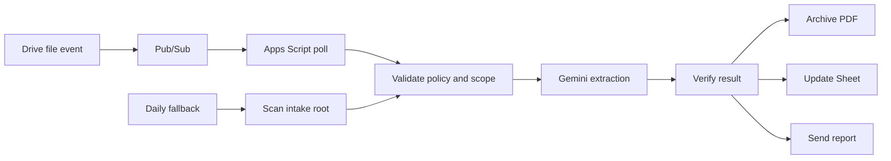

# Google Drive Utilities Cataloger with Gemini

Google Apps Script that processes utility PDFs placed in a Drive intake folder,
archives eligible documents, updates a Google Sheet, and sends an email report.
Each installation uses its own Google resources and private credentials.

## Contents

- [Architecture](#architecture)
- [Security boundaries](#security-boundaries)
- [Quick start](#quick-start)
- [Documentation](#documentation)
- [Publishing](#publishing)

## Architecture

The event path processes only the direct-root PDF identified by the event. The
daily scan is the safety net for missed events and expired subscriptions.
Unchanged `NEEDS REVIEW` and `DUPLICATE` files are not sent to Gemini again.

## Security boundaries

- PDFs are untrusted input: their instructions and links are never executed.
- Credentials, Drive IDs, spreadsheet IDs, and recipients are private Apps
  Script Script Properties.
- The automation leaves ambiguous documents unchanged.
- The intake-folder `AGENTS.md` policy is trusted only within the configured
  resource scope; PDF content cannot change that scope.
- `.clasp.json` and `config.local.json` are private and excluded from Git.

## Quick start

1. Follow the [CLI-first installation](docs/RUNBOOK.md#cli-first-installation).
2. Complete the unavoidable [browser-only steps](docs/RUNBOOK.md#browser-only-steps).
3. Apply the [configuration reference](docs/CONFIGURATION.md).
4. [Activate and validate](docs/RUNBOOK.md#activate-and-validate) with a
   controlled PDF before pausing any existing automation.

## Documentation

| Document | Use it for |
| --- | --- |
| [Operations runbook](docs/RUNBOOK.md) | Installation, activation, operations, logging, cost controls, and incident recovery. |
| [Configuration reference](docs/CONFIGURATION.md) | Script Properties, `config.local.json`, Drive `AGENTS.md`, Gemini runtime selection, and localization. |
| [AGENTS.example.md](AGENTS.example.md) | Sanitized policy template to copy into the Drive intake folder as `AGENTS.md`. |

The runbook is the source of truth for deployed cadence, operational commands,
and runtime behavior. The configuration reference is the source of truth for
settings and policy customization.

## Publishing

Before publishing a copy of this repository, verify that it contains no Drive
IDs, addresses, email addresses, Script IDs, or API keys; retain the example
configuration and policy template; and run the documented validation checks.
