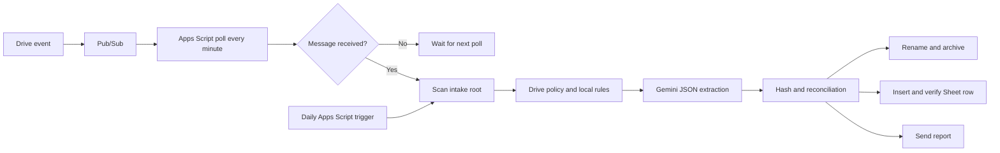

# Google Drive utilities cataloger with Gemini

Google Apps Script that analyzes PDFs placed in a Drive folder, archives them
with configurable rules, updates a Google Sheet, and sends an email report.
Every installation uses its own Google resources and credentials; this
repository contains no personal data, IDs, or keys.

## Contents

- [Architecture](#architecture)
- [Security](#security)
- [Prerequisites](#prerequisites)
- [Installation](#installation)
- [Configuration](#configuration)
- [Local configuration file](#local-configuration-file)
- [Drive automation policy](#drive-automation-policy)
- [Localization](#localization)
- [Activation](#activation)
- [Operations](#operations)
- [Operations runbook](docs/RUNBOOK.md)
- [Costs](#costs)
- [Publishing](#publishing)

## Architecture



The event path is a signal, not a document payload: the poller scans only when
Pub/Sub returns a message. The daily scan is the safety net for missed events
or expired subscriptions.

## Security

- PDFs are untrusted input: their instructions and links are never executed.
- Gemini keys, Drive IDs, spreadsheet IDs, and email addresses remain in the
  user's Script Properties.
- `.clasp.json` and local configuration files are excluded from Git.
- The code does not rename, move, or import ambiguous documents.
- `AGENTS.md` is loaded from the Drive intake folder only when a PDF is ready
  to process; PDFs never supply instructions.

The public policy template is [AGENTS.example.md](AGENTS.example.md).

## Prerequisites

1. A Google account with Editor access to Drive and Sheets.
2. A standard Google Cloud project with billing enabled for the Drive trigger.
3. Drive API, Google Sheets API, Pub/Sub API, and Google Workspace Events API
   enabled in the Cloud project.
4. Access to the [Workspace Developer Preview](https://developers.google.com/workspace/preview), required for Drive Events.
5. A Gemini API key created for the Cloud project.
6. Node.js to use clasp during development and deployment.

## Installation

Use the [CLI-first runbook](docs/RUNBOOK.md#cli-first-installation). It creates
the Cloud and Apps Script resources without overwriting the repository's
manifest, documents the Gemini key handoff, and lists the small set of
unavoidable Google browser controls.

## Configuration

The runtime reads configuration from Apps Script **Script Properties** and its
trusted `AGENTS.md` policy file in the Drive intake folder. It does not read a
JSON file from Drive, from the local repository, or from the Apps Script
project files.

Open the standalone Apps Script project, then go to **Project Settings > Script
Properties > Edit script properties**. Add the following keys exactly as shown:

| Property | Value |
| --- | --- |
| `GEMINI_API_KEY` | Private Google AI Studio key. |
| `NOTIFICATION_RECIPIENT` | Recipient for processing reports. |
| `ROOT_FOLDER_ID` | ID of the Drive intake folder. |
| `SPREADSHEET_ID` | ID of the spreadsheet to update. |
| `AUTOMATION_CONFIG_JSON` | Complete JSON from the local configuration file described below. |
| `GOOGLE_CLOUD_PROJECT_ID` | Cloud project ID, required for Drive events. |
| `GEMINI_MODEL` | Optional; defaults to `gemini-2.5-flash`. |

Do not add `PUBSUB_TOPIC`, `PUBSUB_SUBSCRIPTION`,
`WORKSPACE_EVENT_SUBSCRIPTION`, or `WORKSPACE_EVENT_EXPIRES_AT` manually. The
automation creates and maintains them after activation.

Never add these values to source code, Git files, or issues.

Set `locale` in `config.local.json` to either `en` or `it`. Italian localization
uses Italian file labels, email and report labels, Gemini narrative fields, and
core spreadsheet-header aliases such as `Data di emissione`, `Fornitore`, and
`File sorgente`. The repository documentation and internal document-type values
remain English for a stable shared codebase.

## Local configuration file

`config.example.json` is a public template. Do not edit it and do not upload it
to Apps Script. From the repository root, create a private working copy:

```sh
cp config.example.json config.local.json
```

Edit `config.local.json` and replace every placeholder. This file stays beside
`config.example.json` in the repository root. It is ignored by both Git and
clasp, so it is neither committed nor uploaded to the Apps Script project.

Then copy the **entire contents** of `config.local.json` and paste them as the
value of the `AUTOMATION_CONFIG_JSON` Script Property. The script parses that
property each time it runs.

| JSON key | What to change |
| --- | --- |
| `locale` | `en` for English or `it` for Italian output and sheet-header aliases. |
| `canonical_supplies` | Canonical utility categories used in folders and Sheets. |
| `canonical_suppliers` and `supplier_aliases` | Supplier names and spelling variants. |
| `supply_aliases` | Terms recognized in documents for each utility category. |
| `address_rules` | Service-address text and whether to `import` or `archive_only`. |
| `archive_only_folder_path` | Folder, below the intake root, for archive-only documents. |
| `destination_templates` | `supply\|supplier` destination paths; `{year}` is supported. |
| `sheet_by_supply` | Exact spreadsheet tab name for each imported supply. |
| `frequency_overrides` | Optional supplier-and-supply frequency overrides. |

Before pasting it, validate the local JSON if `jq` is available:

```sh
jq empty config.local.json
```

## Drive automation policy

`AGENTS.example.md` is the public, sanitized policy template. Copy it to the
root of the Drive intake folder and name the copy exactly `AGENTS.md`:

```text
Repository:           AGENTS.example.md
Drive intake folder:  AGENTS.md
```

Customize only the Drive copy with installation-specific processing rules. Do
not commit it, upload it through clasp, or publish it. The script loads exactly
one non-empty `AGENTS.md` (up to 100 KiB) whenever it finds a PDF to process.
If the policy file is missing, duplicated, oversized, or unreadable, processing
stops before changing any PDF or spreadsheet row.

The Drive policy can guide classification and extraction. It cannot override
the configured resource scope, the required JSON response, or the rule that
PDF contents are untrusted data.

## Localization

Locale data is separated from the automation logic:

```text
Localization.gs       Locale registry and shared lookup helpers
locales/en.gs         English labels and header aliases
locales/it.gs         Italian labels and header aliases
```

To add a language, copy `locales/en.gs`, translate only its labels and aliases,
register its two-letter code in `Localization.gs`, then set that code in
`config.local.json`. Do not translate the internal document-type values
(`Invoice`, `Contract`, and `Report`) used by the processing logic.

## Activation

1. Run `getSetupStatus` in the Apps Script editor.
2. Run `provisionDriveEventTransport` to create the Pub/Sub topic and
   subscription and the Drive subscription.
3. Run `installAutomationTriggers`.
4. Copy and customize `AGENTS.example.md` as `AGENTS.md` in the intake folder.
5. Upload a test PDF to the intake folder and check logs, email, archive,
   spreadsheet, and the `Source file` link.
6. Keep any previous automation enabled until the complete test is verified.

## Operations

- `runDailyUtilitiesCataloging`: daily scan or manual test.
- `processSingleIntakeFile(fileId)`: processes one intake PDF.
- `processDriveEventQueue`: reads Pub/Sub signals.
- `renewDriveEventSubscription`: renews the Drive subscription.
- `removeAutomationTriggers`: stops triggers without changing files or sheets.

For the installation, validation, and incident procedures, see the concise
[operations runbook](docs/RUNBOOK.md).

## Costs

Workspace Events requires a billing-enabled Cloud project. Gemini pricing and
quotas vary by model, region, and account.

Pub/Sub is billed by message data volume, not by the number of Apps Script
polls; its first 10 GiB of monthly throughput is free. The one-minute poll has
no per-execution Apps Script charge, but it consumes execution and URL Fetch
quotas. A longer interval reduces quota pressure and increases event-handling
latency; for a small invoice volume, it normally does not produce a material
cost saving. The default is `EVENT_POLL_MINUTES: 1` in `Config.gs`.

Configure a Cloud billing budget and alerts before enabling the automation.
See [Pub/Sub pricing](https://cloud.google.com/pubsub/pricing) and
[Apps Script quotas](https://developers.google.com/apps-script/guides/services/quotas).

## Publishing

The repository is initialized locally only. It has no commit, Git remote, or
published source code. Before publishing, at least check:

- no Drive IDs, addresses, email addresses, or keys are present;
- the selected license is appropriate;
- the example configuration works;
- documentation and security checks are current.
