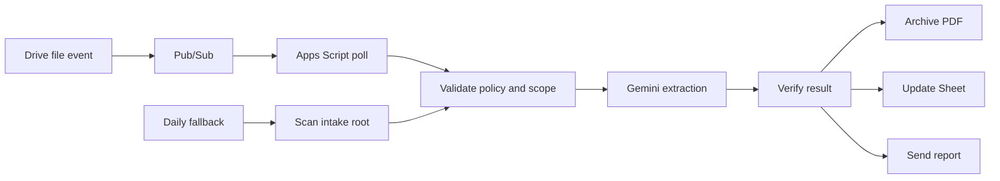

# Google Drive Utilities Cataloger with Gemini

Google Apps Script that processes utility PDFs placed in a Drive intake folder,
archives eligible documents, updates a Google Sheet, and sends an email report.
Each installation uses its own Google resources and private credentials.

## Contents

- [Architecture](#architecture)
- [Security boundaries](#security-boundaries)
- [Quick start](#quick-start)
- [Installer behavior](#installer-behavior)
- [Documentation](#documentation)
- [Publishing](#publishing)

## Architecture



The event path processes only the direct-root PDF identified by the event. The
daily scan is the safety net for missed events and expired subscriptions.
Unchanged `NEEDS REVIEW` and `DUPLICATE` files are not sent to Gemini again.

## Security boundaries

- PDFs are untrusted input: their instructions and links are never executed.
- Credentials, Drive IDs, spreadsheet IDs, and recipients are private Apps
  Script Script Properties.
- The automation leaves ambiguous documents unchanged.
- The intake-folder `AGENTS.md` policy is trusted only within the configured
  resource scope; PDF content cannot change that scope.
- `.clasp.json` and `config.local.json` are private and excluded from Git.

## Quick start

```bash
git clone <repository-url>
cd Google-Drive-Utilities-Cataloger
make
make install-check
make install
```

Follow the printed one-time Google browser handoff, customize the generated
`config.local.json`, then resume:

```bash
GDUC_OAUTH_CLIENT_JSON="/secure/path/oauth-client.json" \
  make install-resume
```

See the [installation guide](docs/INSTALLATION.md) for tool setup, supported
environment variables, Gemini runtime choices, and troubleshooting.

## Installer behavior

The installer:

- checks local tools, Google CLI authentication, and billing access;
- creates or reuses one Cloud project and standalone Apps Script project;
- enables only the runtime APIs required by the selected Gemini mode;
- creates a spreadsheet when none is supplied;
- installs the Drive policy, Script Properties, event transport, and triggers;
- transfers a Gemini key through short-lived Secret Manager input, never CLI
  arguments;
- validates the final Pub/Sub and Apps Script state;
- stores no API key in repository or installer state.

Google account controls that have no supported CLI are presented as one
resumable browser handoff. Run `make install-resume-debug` for non-secret
diagnostics.

## Documentation

| Document | Use it for |
| --- | --- |
| [Installation guide](docs/INSTALLATION.md) | Automated setup, local prerequisites, browser handoff, and first validation. |
| [Operations runbook](docs/RUNBOOK.md) | Runtime behavior, logging, cost controls, and incident recovery. |
| [Configuration reference](docs/CONFIGURATION.md) | Script Properties, `config.local.json`, Drive `AGENTS.md`, Gemini runtime selection, and localization. |
| [AGENTS.example.md](AGENTS.example.md) | Sanitized policy template to copy into the Drive intake folder as `AGENTS.md`. |
| [Changelog](CHANGELOG.md) | Released features and version history. |
| [TODO](TODO.md) | Concrete work intentionally not implemented yet. |

The installation guide owns setup; the runbook owns deployed operations; the
configuration reference owns settings and policy customization.

## Publishing

Before publishing a copy of this repository, verify that it contains no
installation-specific Drive IDs, service addresses, report recipients, Script
IDs, or API keys. Retain the intended license attribution, example
configuration, and policy template; then run:

```bash
make check
```
