# Deployment Guide

This project deploys Apps Script only after a pull request has been merged into
`main`.

## Contents

- [Required repository settings](#required-repository-settings)
- [Required secrets](#required-secrets)
- [What the deployment installs](#what-the-deployment-installs)
- [What the deployment does not install](#what-the-deployment-does-not-install)
- [Deployment flow](#deployment-flow)
- [Manual recovery](#manual-recovery)

## Required repository settings

Protect `main` in GitHub with:

- direct pushes disabled;
- pull requests required;
- at least one approving review;
- approval dismissed when new commits are pushed;
- required status check for the validation workflow;
- conversation resolution required before merge.

Create a GitHub Actions environment named `production`. Restrict it to the
`main` branch and, if desired, require an environment approval before the
deployment job can use its secrets.

## Required secrets

Configure these secrets in the `production` environment:

| Secret | Contents |
| --- | --- |
| `CLASP_AUTH_JSON` | The private `.clasprc.json` for the Google account that owns the Apps Script project. |
| `CLASP_PROJECT_JSON` | The private `.clasp.json`, including `scriptId` and `rootDir`. |
| `APPS_SCRIPT_DEPLOYMENT_ID` | The stable Apps Script deployment ID used by the live installation. |

Do not commit any of these values. The workflow writes them only to the
runner's temporary directory or to the ignored local `.clasp.json`.

## What the deployment installs

After a pull request is merged into `main`, the workflow deploys the exact
merge commit to the configured Apps Script project:

| Component | Action |
| --- | --- |
| Apps Script source | Uploads the repository `.gs` files and `appsscript.json` through `clasp push`. |
| Apps Script version | Creates a numbered version labelled with the merged commit SHA. |
| Stable deployment | Moves `APPS_SCRIPT_DEPLOYMENT_ID` to the new version. |

The stable deployment ID is preserved. Existing users, triggers, and external
URLs that refer to that deployment continue to target the same deployment while
receiving the new source version.

## What the deployment does not install

This workflow is a source deployment, not a complete installation or
reconciliation run. It does not create, modify, or validate:

| Resource or configuration | Status |
| --- | --- |
| Apps Script project | Must already exist and be referenced by `CLASP_PROJECT_JSON`. |
| Script Properties | Not changed. Existing installation-specific values remain in Apps Script. |
| Apps Script triggers | Not created, removed, or changed. |
| Drive folders and files | Not created, moved, renamed, or scanned. |
| Google Sheets | Not created or modified. |
| Pub/Sub and Workspace Events | Not created, renewed, or repaired. |
| Cloud project, APIs, billing, IAM, and Secret Manager | Not provisioned or changed. |
| Repository `AGENTS.md` | Not uploaded to Apps Script; it contains coding-agent guidance only. |
| Drive `AGENTS.md` policy | Not copied or overwritten. The live Drive copy remains authoritative. |
| Gemini credentials and runtime configuration | Not changed. |

Use the [installation guide](INSTALLATION.md) for a new installation. The
deployment workflow assumes that the target installation is already bootstrapped
and that its stable deployment ID is known.

## Deployment flow

The workflow runs on the `closed` event for pull requests targeting `main`, but
the job proceeds only when GitHub reports that the pull request was merged. It
checks out the merge commit, runs `make check`, pushes the source with the
pinned `clasp` version, creates a numbered Apps Script version, and moves the
stable deployment to that version.

```mermaid
flowchart LR
  pr["Pull request"] --> checks["Validation / check"]
  checks --> review["Required approval"]
  review --> merge["Merge into main"]
  merge --> event["pull_request.closed\nmerged = true"]
  event --> checkout["Checkout merge commit"]
  checkout --> validate["Run make check"]
  validate --> push["clasp push"]
  push --> version["Create Apps Script version"]
  version --> deploy["Update stable deployment"]
  deploy --> live["Apps Script runtime"]
```

Therefore an approval alone never deploys code, and a later commit invalidates
the approval according to branch protection. Deployment occurs only for the
exact revision that was merged into `main`.

The workflow serializes production deployments so two merges cannot update the
same Apps Script deployment concurrently.

The `Validation / check` status from `.github/workflows/ci.yml` is the status
check to require in the branch protection rule. The deployment workflow repeats
the same validation after merge as a final guard before changing Apps Script.

## Manual recovery

If a deployment fails, correct the workflow or source issue in a new pull
request. Re-running the failed workflow is safe only after confirming that the
same merge commit is still the intended production revision.

For an intentional manual deployment, use the same isolated credentials and
stable deployment ID; do not create a second live deployment accidentally.
