# Deployment Guide

This project deploys Apps Script only after a pull request has been merged into
`main`.

## Contents

- [Required repository settings](#required-repository-settings)
- [Required secrets](#required-secrets)
- [Bootstrap production deployment](#bootstrap-production-deployment)
- [Apps Script execution model](#apps-script-execution-model)
- [What the deployment installs](#what-the-deployment-installs)
- [What the deployment does not install](#what-the-deployment-does-not-install)
- [Deployment flow](#deployment-flow)
- [Manual recovery](#manual-recovery)

## Required repository settings

Protect `main` in GitHub with:

- direct pushes disabled;
- pull requests required;
- at least one approving review;
- approval dismissed when new commits are pushed;
- required status check for the validation workflow;
- conversation resolution required before merge.

Create a GitHub Actions environment named `production`. Restrict deployments to
the `main` branch and, if desired, require an environment approval before the
job can use its secrets. The workflow runs on a `push` to `main`; branch
protection makes an approved pull-request merge the only normal source of that
push.

## Required secrets

Configure these secrets in the `production` environment:

| Secret | Contents |
| --- | --- |
| `CLASP_AUTH_JSON` | The private `.clasprc.json` for the Google account that owns the Apps Script project. |
| `CLASP_PROJECT_JSON` | The installation `.clasp.json`, with its `scriptId` and `rootDir` set to `.`. |
| `APPS_SCRIPT_DEPLOYMENT_ID` | The stable, owner-only API executable deployment ID created by the installer. |

Do not commit any of these values. The workflow writes them only to the
runner's temporary directory or to the ignored local `.clasp.json`.

`CLASP_AUTH_JSON` must authorize the
[`https://www.googleapis.com/auth/script.deployments` OAuth
scope](https://developers.google.com/apps-script/api/reference/rest/v1/projects.deployments/get#authorization-scopes).
`clasp login --include-clasp-scopes` requests this management scope. The
workflow needs it both to update the deployment and to inspect it through the
Apps Script Deployments API.

Here, `MYSELF` means the Google account that created or updates the deployment.
The deployment is operationally owner-only only when `CLASP_AUTH_JSON` belongs
to the Apps Script project owner; using another deployer would restrict access
to that deployer instead.

## Bootstrap production deployment

Complete this once before merging the pull request that introduces the
deployment workflow. The first merge cannot deploy successfully until the
environment and all three secrets exist.

1. Preserve `.clasp.json` and `.installer/state.json` from the completed
   installation. If `GDUC_STATE_DIR` was used, substitute that directory for
   `.installer`.
2. Open [Google Auth Platform >
   Clients](https://console.cloud.google.com/auth/clients), select the
   installation's Cloud project, and download a **Desktop app** client JSON as
   described in the [installation guide](INSTALLATION.md#desktop-oauth-client).
   Also confirm that the [Apps Script API account
   setting](https://script.google.com/home/usersettings) is enabled.
3. Create `production` and restrict it to `main`. The environment can also be
   configured on GitHub's [Environments settings
   page](https://github.com/marcomc/Google-Drive-Utilities-Cataloger/settings/environments).

   ```bash
   gh api --method PUT \
     repos/marcomc/Google-Drive-Utilities-Cataloger/environments/production \
     --input - <<'JSON'
   {
     "deployment_branch_policy": {
       "protected_branches": false,
       "custom_branch_policies": true
     }
   }
   JSON
   gh api --method POST \
     repos/marcomc/Google-Drive-Utilities-Cataloger/environments/production/deployment-branch-policies \
     -f name=main -f type=branch
   ```

4. In one fail-closed subshell, create the temporary authorization, verify the
   deployment through the same read-only API check as CI, and upload all three
   secrets. The installer deletes its own authorization, so do not expect to
   reuse it. The generated `.clasprc.json` becomes `CLASP_AUTH_JSON`.

   ```bash
   (
     set -euo pipefail
     DEPLOY_AUTH_DIR="$(mktemp -d)"
     trap 'rm -rf "$DEPLOY_AUTH_DIR"' EXIT
     DEPLOY_AUTH_FILE="$DEPLOY_AUTH_DIR/.clasprc.json"
     chmod 700 "$DEPLOY_AUTH_DIR"
     clasp -A "$DEPLOY_AUTH_FILE" login \
       --creds "/secure/path/oauth-client.json" \
       --use-project-scopes \
       --include-clasp-scopes
     chmod 600 "$DEPLOY_AUTH_FILE"

     DEPLOYMENT_ID="$(jq -er '.deploymentId' .installer/state.json)"
     SCRIPT_ID="$(jq -er '.scriptId' .clasp.json)"
     test "$(jq -er '.rootDir' .clasp.json)" = "."
     CLASP=(clasp)
     source scripts/lib/apps-script-deployment.sh
     DEPLOYMENT_JSON=""
     read_apps_script_deployment \
       "$DEPLOY_AUTH_FILE" "$SCRIPT_ID" "$DEPLOYMENT_ID" DEPLOYMENT_JSON
     validate_owner_only_api_deployment \
       "$DEPLOYMENT_JSON" "$SCRIPT_ID" "$DEPLOYMENT_ID"
     unset DEPLOYMENT_JSON

     gh secret set CLASP_AUTH_JSON --env production \
       <"$DEPLOY_AUTH_FILE"
     gh secret set CLASP_PROJECT_JSON --env production <.clasp.json
     printf '%s' "$DEPLOYMENT_ID" |
       gh secret set APPS_SCRIPT_DEPLOYMENT_ID --env production
   )
   ```

   Validation requires the configured deployment ID, matching `scriptId`, a
   numbered version, the `appsscript` manifest, and an `EXECUTION_API` entry
   point whose access is `MYSELF`. A missing or incompatible deployment is not
   deleted or replaced automatically.

5. Confirm the names without printing secret values:

   ```bash
   gh secret list --env production
   ```

## Apps Script execution model

The update has two related but distinct effects:

| Runtime path | Source used after deployment |
| --- | --- |
| Daily, Pub/Sub poll, and subscription-renewal installable triggers | Project HEAD uploaded by `clasp push`. |
| Owner-only installer calls through the Apps Script Execution API | The numbered version selected by `APPS_SCRIPT_DEPLOYMENT_ID`. |

The deployment ID does not control the installable triggers. They execute the
project HEAD. Updating the stable deployment keeps the owner-only API executable
on the same source revision as those triggers.

## What the deployment installs

After a pull request is merged into `main`, the workflow deploys the exact
merge commit to the configured Apps Script project:

| Component | Action |
| --- | --- |
| Apps Script source | Uploads root and `locales/` `.gs` files plus `appsscript.json` through `clasp push`. |
| Apps Script version | Creates a numbered version labelled with the merged commit SHA. |
| API executable | Moves `APPS_SCRIPT_DEPLOYMENT_ID` to the new numbered version. |
| Manifest time zone | Reads and preserves the target project's current `timeZone` before upload. |

The stable API executable deployment ID is preserved. Before `clasp push`, the
workflow reads it through the official Deployments API and validates its script
ID, numbered version, `appsscript` manifest, and `EXECUTION_API`/`MYSELF` entry
point. After
`clasp deploy --deploymentId`, it reads the deployment again and requires the
same deployment ID, the new version, and an unchanged entry-point structure.

The workflow deliberately retains `clasp deploy --deploymentId`. The existing
manifest already declares owner-only Execution API access, and the pre/post API
comparison proves whether `clasp` preserved it. Direct deployment `PUT` is not
needed and would require rebuilding a configuration that does not otherwise
need to change.

## What the deployment does not install

This workflow updates source and the existing API executable. It is not a
complete installation or resource-reconciliation run. It does not create or
modify:

| Resource or configuration | Status |
| --- | --- |
| Apps Script project | Must already exist; its identity and deployment are validated before upload. |
| Script Properties | Not changed. Existing installation-specific values remain in Apps Script. |
| Apps Script triggers | Not created, removed, or changed; existing triggers run the new project HEAD. |
| Drive folders and files | Not created, moved, renamed, or scanned. |
| Google Sheets | Not created or modified. |
| Pub/Sub and Workspace Events | Not changed by the workflow itself. After deployment, the scheduled renewal handler can replace an explicitly inaccessible Workspace Events subscription; mismatched Pub/Sub names fail closed. |
| Cloud project, APIs, billing, IAM, and Secret Manager | Not provisioned or changed. |
| Repository `AGENTS.md` | Not uploaded to Apps Script; it contains coding-agent guidance only. |
| Drive `AGENTS.md` policy | Not copied or overwritten. The live Drive copy remains authoritative. |
| Gemini credentials and runtime configuration | Not changed. |

The workflow preserves the installed manifest time zone but does not read
`config.local.json` or installer state. To change the installation time zone,
use the explicit
[`--reconfigure-time-zone`](INSTALLATION.md#reconfigure-time-zone) installer
operation; a normal source deployment is intentionally not a configuration
reconciliation.

Use the [installation guide](INSTALLATION.md) for a new installation. The
deployment workflow assumes that the target installation is already bootstrapped
and that its stable deployment ID is known.

## Deployment flow

The workflow runs when protected `main` advances. It checks out that revision,
runs `make check`, rejects stale runs, validates the target project and API
deployment, preserves the live manifest time zone, pushes source with the
pinned `clasp` version, creates a numbered version, and moves the stable API
executable to that version.

```mermaid
flowchart LR
  pr["Pull request"] --> checks["Validation / check"]
  checks --> review["Required approval"]
  review --> merge["Merge into main"]
  merge --> event["Push protected main"]
  event --> checkout["Checkout main commit"]
  checkout --> validate["Run make check"]
  validate --> target["Verify newest main commit"]
  target --> preflight["GET deployment: script ID and EXECUTION_API / MYSELF"]
  preflight --> manifest["Preserve live time zone"]
  manifest --> push["clasp push to project HEAD"]
  push --> triggers["Installable triggers use HEAD"]
  push --> version["Create numbered version"]
  version --> deploy["Update stable API executable"]
  deploy --> postflight["GET deployment: version and unchanged entry points"]
  postflight --> api["Owner-only installer calls"]
```



Therefore an approval alone never deploys code, and closing a pull request
without merging does not deploy. A later commit invalidates the approval under
branch protection. Deployment starts only when the approved revision updates
`main`.

The workflow lets an active deployment finish, serializes later runs, and
verifies the current remote `main` SHA before mutation. A queued stale run exits
without pushing, while the newest revision proceeds. This avoids both an older
revision becoming final and cancellation between the HEAD and API-executable
updates.

The `Validation / check` status from `.github/workflows/ci.yml` is the status
check to require in the branch protection rule. The deployment workflow repeats
the same validation after merge as a final guard before changing Apps Script.

## Manual recovery

If failure occurs before `clasp push`, Apps Script is unchanged. If it occurs
after `clasp push` but before the stable API executable is updated, installable
triggers can temporarily run the new HEAD while the API executable remains on
the previous numbered version.

When the failed run is still the current `main` revision, re-run that workflow;
its preflight verifies the target again and aligns both runtime paths. If source
must be rolled back, merge a revert pull request. The resulting `main` push
uploads the reverted source to HEAD, creates a new immutable version, and moves
the stable API executable to that matching version.

After recovery, use one temporary authorization to rerun the complete API
validation and derive the Executions URL. The cleanup trap removes it on both
success and failure:

```bash
(
  set -euo pipefail
  DEPLOY_AUTH_DIR="$(mktemp -d)"
  trap 'rm -rf "$DEPLOY_AUTH_DIR"' EXIT
  DEPLOY_AUTH_FILE="$DEPLOY_AUTH_DIR/.clasprc.json"
  chmod 700 "$DEPLOY_AUTH_DIR"
  clasp -A "$DEPLOY_AUTH_FILE" login \
    --creds "/secure/path/oauth-client.json" \
    --use-project-scopes \
    --include-clasp-scopes
  chmod 600 "$DEPLOY_AUTH_FILE"
  SCRIPT_ID="$(jq -er '.scriptId' .clasp.json)"
  DEPLOYMENT_ID="$(jq -er '.deploymentId' .installer/state.json)"
  CLASP=(clasp)
  source scripts/lib/apps-script-deployment.sh
  DEPLOYMENT_JSON=""
  read_apps_script_deployment \
    "$DEPLOY_AUTH_FILE" "$SCRIPT_ID" "$DEPLOYMENT_ID" DEPLOYMENT_JSON
  validate_owner_only_api_deployment \
    "$DEPLOYMENT_JSON" "$SCRIPT_ID" "$DEPLOYMENT_ID"
  unset DEPLOYMENT_JSON
  printf 'https://script.google.com/home/projects/%s/executions\n' "$SCRIPT_ID"
)
```

Open the printed Executions URL and confirm successful recent runs for the
daily, Pub/Sub poll, and subscription-renewal handlers. The Deployments API
check verifies the API executable; the Executions page verifies trigger health.

For an intentional manual deployment, use the same isolated credentials and
stable deployment ID, preserve the target manifest time zone, and run the same
identity preflight before `clasp push`. Do not create a second API executable
deployment accidentally.
