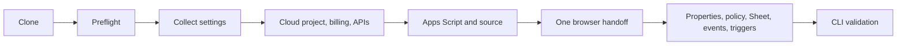
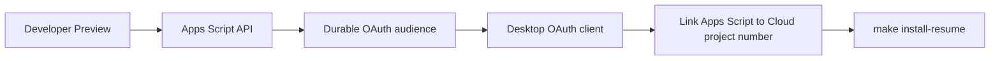

# Installation Guide

This guide installs one private Google Drive Utilities Cataloger instance. The
installer creates and validates the Google resources; it pauses only for Google
account controls that have no supported CLI.

## Contents

- [Quick start](#quick-start)
- [Installation flow](#installation-flow)
- [Local tools](#local-tools)
- [Google Cloud CLI](#google-cloud-cli)
- [Cloud billing](#cloud-billing)
- [clasp](#clasp)
- [Project settings](#project-settings)
- [Drive and spreadsheet](#drive-and-spreadsheet)
- [Gemini runtime](#gemini-runtime)
- [Gemini API key](#gemini-api-key)
- [Google resource bootstrap](#google-resource-bootstrap)
- [Environment variable reference](#environment-variable-reference)
- [Reconfigure time zone](#reconfigure-time-zone)
- [Browser handoff](#browser-handoff)
- [Apps Script API](#apps-script-api)
- [Desktop OAuth client](#desktop-oauth-client)
- [Apps Script project](#apps-script-project)
- [API executable](#api-executable)
- [Controlled validation](#controlled-validation)
- [Apps Script execution errors](#apps-script-execution-errors)
- [Resetting private installer state](#resetting-private-installer-state)
- [Adopting an existing installation](#adopting-an-existing-installation)

## Quick start

```bash
git clone <repository-url>
cd Google-Drive-Utilities-Cataloger

make
make install-check
make install
```

The first run collects non-secret settings, provisions Google Cloud, creates
the Apps Script project, and prints the browser handoff. Customize the generated
`config.local.json`, complete the browser steps, then resume:

```bash
GDUC_OAUTH_CLIENT_JSON="/secure/path/oauth-client.json" \
  make install-resume
```

The resume step prompts privately for `GEMINI_API_KEY` when the selected
runtime needs one. The direct-script equivalents are:

```bash
./scripts/install.sh --help
./scripts/install.sh
./scripts/install.sh --resume
./scripts/install.sh --resume --debug
```

`--debug` adds non-secret diagnostics. It never enables shell tracing or prints
credentials.

## Installation flow



The installer stores non-secret progress in `.installer/state.json` and holds a
portable lock while changing it or Google resources. Temporary owner-only
`clasp` profiles live in `.installer/clasp-management-auth/` during project
creation and `.installer/clasp-auth/` during bootstrap. They are isolated from
the user's global `clasp` profile, ignored by Git, permission-repaired on
resume, and removed after success or reset. Private bootstrap data is never
stored there.

## Local tools

Required:

| Tool | Minimum or purpose |
| --- | --- |
| Bash | System Bash is sufficient. |
| Git and Make | Clone and command entry points. |
| Node.js and `npx` | Node.js 20 or newer; runs pinned `clasp` 3.3.0. |
| `jq` | JSON validation and state handling. |
| Google Cloud CLI | Project, billing, API, and Pub/Sub operations. |
| Standard userland | `awk`, `cat`, `chmod`, `cp`, `date`, `dirname`, `mkdir`, `mktemp`, `mv`, `rm`, `rmdir`, `sed`, `sleep`, `tr`, and `uname`. |

macOS with Homebrew:

```bash
xcode-select --install
brew install git jq node
brew install --cask google-cloud-sdk
```

Debian or Ubuntu:

```bash
sudo apt-get update
sudo apt-get install --yes bash git jq make nodejs npm
```

If the distribution does not provide Node.js 20 or a current Google Cloud CLI,
use the official installers:

- [Install Node.js](https://nodejs.org/en/download)
- [Install Google Cloud CLI](https://cloud.google.com/sdk/docs/install)

Recheck without changing Google resources:

```bash
make install-check
```

This checks local tools, the active Google Cloud CLI account, billing access,
and any existing isolated Apps Script authorization. If none exists, it reports
that the authorization will be created during `make install`; it never reads or
creates a global `clasp` login.

Contributors also need `shellcheck` and `markdownlint-cli`; runtime users do
not.

## Google Cloud CLI

Authorize the Google account that will own the Apps Script project and can
access the Drive resources:

```bash
gcloud auth login
gcloud auth list
gcloud projects list --limit=5
```

Application Default Credentials are not used. The installer uses the active
`gcloud` user for Cloud provisioning and a separate owner-only `clasp` login
for Apps Script execution. Both authorizations must use the same Google
account because that identity owns the complete runtime lifecycle.

## Cloud billing

The Drive Workspace Events path requires a billing-enabled standard Cloud
project. The installer lists open billing accounts and asks which one to link:

```bash
gcloud billing accounts list --filter='open=true'
```

The active user needs permission to create or reuse the project, link the
billing account, and enable services. Existing organization policy still
applies; the installer does not grant itself organization or billing roles.

## clasp

No global `clasp` installation or login is required. Every command uses the
pinned version and an installer-owned authorization profile:

```bash
npx --yes @google/clasp@3.3.0 --version
```

The account-level Apps Script API must also be enabled as described in
[Apps Script API](#apps-script-api).

## Project settings

The installer asks for:

| Setting | Default |
| --- | --- |
| Cloud and Apps Script display name | `Drive Utilities Cataloger` |
| Globally unique Cloud project ID | Generated suggestion |
| Billing account | First open account |
| Output locale | `en` |
| Apps Script time zone | `Europe/Rome` |
| Report recipient | Active `gcloud` account |
| Gemini runtime | Gemini Developer API |

Use an IANA time zone such as `Europe/Rome`. Bundled locales are `en` and `it`.
Locale controls reports, generated spreadsheet headers, and document labels;
extraction rules remain in `config.local.json`.

The installer creates `config.local.json` from `config.example.json`. Before
resume, replace the example suppliers, addresses, destinations, and tab names:

```bash
${EDITOR:-vi} config.local.json
node scripts/validate-config.js config.local.json
```

An unchanged example configuration is rejected. See the
[configuration reference](CONFIGURATION.md#local-configuration-file).

## Drive and spreadsheet

Create or select the Drive intake folder first, then paste its URL or ID. The
installer verifies access through the owner-authorized Apps Script execution.

For the spreadsheet:

- Leave the answer empty to create it in the intake folder.
- Or paste an existing Google Sheets URL or ID.
- Missing configured tabs receive localized minimal headers.
- Existing non-empty tabs must contain issue date, supplier, invoice number,
  and source-file headers.
- A populated existing spreadsheet must already use the selected locale and
  time zone; the installer refuses to change workbook-wide settings silently.
- Existing utility tabs may keep title rows above their real column headers;
  validation uses the same bounded header-row detection as runtime imports.
- Unrelated existing tabs are not deleted.

For an installation with the `Electricity` supply, the installer also manages
an electricity statistics dashboard and a hidden technical-data sheet. The
dashboard is generated in the selected installation locale (English by
default; Italian is supported) and its managed charts are rebuilt from live
sheet formulas. Before a rebuild, the installer captures each managed chart's
position, offsets, dimensions, and title; existing user-adjusted geometry is
preserved, while default geometry is used only for a new chart.

If no intake `AGENTS.md` exists, the installer creates one from the public
`AGENTS.example.md` template. It preserves one existing non-empty policy and
fails if the folder contains duplicates or a policy larger than 40 KiB.
Customize the Drive copy, not the repository template.

Required ownership and access:

| Resource | Installer account needs |
| --- | --- |
| Intake folder and child folders | Editor in My Drive; Content manager or Manager in a shared drive |
| Existing spreadsheet | Editor |
| Apps Script project | Owner |
| Cloud project | API enablement, Pub/Sub, and project access |
| Billing account | Project-link permission |

The runtime creates the configured folders, Pub/Sub resources, Drive event
subscription, publisher IAM binding, and Apps Script triggers.

## Gemini runtime

| Installer choice | Credential | Cloud service |
| --- | --- | --- |
| `gemini_api` | Gemini API key | Google AI Studio project |
| `vertex_ai` | Apps Script OAuth | Vertex AI in the cataloger Cloud project |
| `gemini_api_with_vertex_fallback` | API key plus Apps Script OAuth | Both |

For the fallback mode, Gemini Developer API remains primary. A verified daily
quota exhaustion or depleted prepayment-credit response routes the current PDF
and the following hour to Vertex AI. Generic short-lived rate limits stay on
the Developer API and receive the normal bounded retry.

The cataloger Cloud project must have billing for Workspace Events. That does
not require the Gemini API key to belong to the same project. To preserve a
Gemini Free Tier project, create or select that key in Google AI Studio and do
not upgrade that key's project to a paid Gemini plan.

Gemini API keys inherit billing and quota from their project; a key has no
independent tier. Vertex AI never uses `GEMINI_API_KEY`.

Every mode enables Secret Manager in the cataloger Cloud project for the
private bootstrap handoff described below. The Gemini API itself remains in
the Google AI Studio key's project.

## Gemini API key

Create or select a key at the
[Google AI Studio API keys page](https://aistudio.google.com/app/apikey).
Restrict it to the Generative Language API. Apps Script has no fixed source IP
or browser referrer, so caller restrictions are not suitable.

The CLI alternative for an already selected Gemini key project is:

```bash
GEMINI_PROJECT_ID="your-gemini-key-project"

gcloud services enable \
  --project="${GEMINI_PROJECT_ID}" \
  apikeys.googleapis.com \
  generativelanguage.googleapis.com

gcloud services api-keys create \
  --project="${GEMINI_PROJECT_ID}" \
  --display-name="drive-utilities-cataloger-gemini" \
  --api-target=service=generativelanguage.googleapis.com \
  --format='value(response.keyString)'
```

Save the printed key in a password manager immediately. The installer reads it
from a hidden prompt or `GDUC_GEMINI_API_KEY`. Bootstrap validates the key and
model and stores the key in Script Properties.

Free or paid Gemini status is changed on the key's project in Google AI Studio;
creating a new key is not inherently required when that same project changes
tier.

## Google resource bootstrap

The installer builds the complete private bootstrap payload from the
installation state, `config.local.json`, `AGENTS.example.md`, and the optional
Gemini key. It pipes that payload to an installation-specific temporary Secret
Manager version. Only the non-secret version resource name is passed through
`clasp run`; private values do not appear in command arguments.

The installer grants the same owner temporary Secret Accessor permission on
only this installation's bootstrap secret. The secret name includes the Apps
Script ID, and an ownership label prevents reuse or deletion of an unrelated
secret.

The payload is never written to `.installer/`, command arguments, logs, or Git.
A failed resume retains the encrypted bootstrap secret so the next resume can
continue. Successful installation deletes it; if cleanup fails, the installer
prints the exact secret name to remove.

## Environment variable reference

Use the interactive flow by default. These variables support repeatable or
non-interactive installation:

| Variable | Meaning |
| --- | --- |
| `GDUC_PROJECT_NAME` | Cloud and Apps Script display name |
| `GDUC_PROJECT_ID` | Globally unique Cloud project ID |
| `GDUC_REUSE_PROJECT=true` | Permit reuse of an existing project |
| `GDUC_BILLING_ACCOUNT_ID` | Billing account ID, without or with prefix |
| `GDUC_ALLOW_BILLING_RELINK=true` | Separately permit changing billing on a reused project |
| `GDUC_LOCALE` | Bundled locale code: `en` or `it` |
| `GDUC_TIME_ZONE` | IANA time zone |
| `GDUC_NOTIFICATION_RECIPIENT` | Report email address |
| `GDUC_ROOT_FOLDER` | Drive intake-folder URL or ID |
| `GDUC_SPREADSHEET` | Optional spreadsheet URL or ID |
| `GDUC_SPREADSHEET_TITLE` | Title used when creating a spreadsheet |
| `GDUC_GEMINI_MODE` | `gemini_api`, `vertex_ai`, or `gemini_api_with_vertex_fallback` |
| `GDUC_GEMINI_MODEL` | Optional model; default `gemini-3.6-flash`; may override the pending value on resume |
| `GDUC_VERTEX_AI_LOCATION` | Optional Vertex location; default `global`; may override the pending value on resume |
| `GDUC_OAUTH_CLIENT_JSON` | Desktop OAuth client JSON outside the checkout, used on resume |
| `GDUC_GEMINI_API_KEY` | Secret; required on resume for Gemini API |
| `GDUC_STATE_DIR` | Optional absolute state path outside the checkout; it must be absent, empty, or already installer-owned |
| `NO_COLOR` | Disable terminal colors when non-empty |

When using `GDUC_STATE_DIR`, export the same value for every install, resume,
reconfiguration, debug, and reset command. Its parent directory must already
exist. The target must resolve outside the checkout and must be absent, empty,
or already marked as installer-owned.

Example initial non-interactive pass:

```bash
GDUC_PROJECT_NAME="My Utilities Cataloger" \
GDUC_PROJECT_ID="my-utilities-cataloger-1234" \
GDUC_REUSE_PROJECT=false \
GDUC_BILLING_ACCOUNT_ID="000000-000000-000000" \
GDUC_LOCALE="en" \
GDUC_TIME_ZONE="Europe/Rome" \
GDUC_NOTIFICATION_RECIPIENT="operator@example.com" \
GDUC_ROOT_FOLDER="https://drive.google.com/drive/folders/FOLDER_ID" \
GDUC_SPREADSHEET_TITLE="Utilities" \
GDUC_GEMINI_MODE="gemini_api" \
./scripts/install.sh --non-interactive --no-open
```

Edit `config.local.json`, complete the browser handoff, then inject the secret
without placing it in shell history:

```bash
printf 'GEMINI_API_KEY: '
IFS= read -r -s GDUC_GEMINI_API_KEY
printf '\n'
export GDUC_GEMINI_API_KEY

GDUC_OAUTH_CLIENT_JSON="/secure/path/oauth-client.json" \
./scripts/install.sh --resume --non-interactive

unset GDUC_GEMINI_API_KEY
```

For unattended use, inject `GDUC_GEMINI_API_KEY` from the process secret
manager instead.

## Reconfigure time zone

Edit `time_zone` in `config.local.json`, then run:

```bash
GDUC_OAUTH_CLIENT_JSON="/secure/path/oauth-client.json" \
./scripts/install.sh --reconfigure-time-zone --non-interactive
```

If the installation uses `GDUC_STATE_DIR`, export that same path for this
command too.

The equivalent Make target is `make install-reconfigure-time-zone`. Set
`GDUC_TIME_ZONE` for a one-command override without changing
`config.local.json`:

```bash
GDUC_TIME_ZONE="Pacific/Auckland" \
GDUC_OAUTH_CLIENT_JSON="/secure/path/oauth-client.json" \
./scripts/install.sh --reconfigure-time-zone --non-interactive
```

The command accepts only a real IANA time-zone identifier. It updates the
installer state, the spreadsheet time zone, `AUTOMATION_CONFIG_JSON`, and the
manifest used for the remote push as one operation. It does not recreate or
read the deleted bootstrap secret, change Gemini credentials, or alter existing
triggers, Pub/Sub resources, Workspace Events subscriptions, or processing
state.

Before mutation, the installed API executable starts a durable maintenance
transaction and returns the live spreadsheet/configuration timezone as the
rollback baseline. Catalog processing entry points skip work while that
transaction is active. The installer pulls the current remote project and
changes only its manifest timezone, so unrelated local working-tree source is
never deployed and all other installed manifest fields are preserved by this
command.

The tracked `appsscript.json` is modified only inside a guarded subshell. Its
original bytes are restored after a successful push, a failed push, or a
handled interruption. If the Apps Script update fails after the push, the
installer attempts to restore both the previous remote configuration and
manifest, verifies the rollback response, retains `pendingTimeZone`, and exits
non-zero. If convergence or maintenance cleanup cannot be proven, processing
remains paused and the next invocation resumes the same transaction. A later
invocation recovers the single retained manifest backup left by
an uncatchable process termination and fails closed if multiple backups require
manual review. A `GDUC_TIME_ZONE` override is intentionally temporary: update
`config.local.json` too when it should become the local default.

## Browser handoff

The installer prints project-specific URLs and opens them unless `--no-open`
is set. Complete these once, in order:



1. Join the [Google Workspace Developer Preview](https://developers.google.com/workspace/preview)
   if the account is not already enrolled.
2. Enable the account-level Apps Script API.
3. Configure a durable Google Auth audience using the decision table below.
4. Create and download a Desktop OAuth client in the cataloger Cloud project.
5. In Apps Script project settings, change the linked Google Cloud project to
   the project number printed by the installer.
6. Customize `config.local.json`.

Linking changes only this Apps Script project. It does not modify another Apps
Script project owned by the same account.

| Account and project | Durable OAuth choice |
| --- | --- |
| Workspace project inside the operator's organization | `Internal` |
| Workspace administrator explicitly trusts the app | The administrator's `Trusted` override |
| Personal Google account or project outside an organization | `External`, then **Publish app** to `In production` before authorizing |

Do not leave an untrusted `External` app in `Testing`. Authorizations that
request these non-basic scopes expire after seven days, including their refresh
tokens. An unverified external app in production can display a warning and is
subject to Google's user cap; each cloned private installation is intended for
its owner. Public or multi-user distribution can require OAuth verification.
See Google's [audience and publishing status
reference](https://support.google.com/cloud/answer/15549945).

## Apps Script API

Enable **Google Apps Script API** for the installer account:

<https://script.google.com/home/usersettings>

This account-level setting lets `clasp` create and update projects. The
installer also enables `script.googleapis.com` in the standard Cloud project.
Both are required.

## Desktop OAuth client

Open [Google Auth Platform > Clients](https://console.cloud.google.com/auth/clients),
select the installation's Cloud project, then:

1. Select **Create client**.
2. Choose **Desktop app**.
3. Download the JSON file.
4. Pass its path through `GDUC_OAUTH_CLIENT_JSON` on resume.

Google's [OAuth guide for desktop
applications](https://developers.google.com/identity/protocols/oauth2/native-app)
documents the underlying authorization flow.

The installer rejects a client whose ID does not start with the selected Cloud
project number. Keep the JSON private, save it with the other project secrets
if it must be retained, and remove stray copies from Downloads. Its resolved
path must be outside the repository checkout.

## Apps Script project

The installer creates the standalone Apps Script project in a temporary
directory, then writes only the private mapping to `.clasp.json`. This prevents
generated `Code.gs` or manifests from overwriting repository source.

In Apps Script **Project Settings**, change the Google Cloud project to the
numeric project number printed by the installer. The project ID stored in
`.clasp.json` does not perform this runtime link.

`.clasp.json` is private and ignored by Git.

## API executable

Resume creates a versioned, owner-only Apps Script API executable. It exists
only so the installer can invoke `bootstrapCatalogerInstallation` and
`validateCatalogerInstallation`; there is no public web application.

The installer reads every stored or newly created deployment through the
[Apps Script Deployments
API](https://developers.google.com/apps-script/api/reference/rest/v1/projects.deployments/get)
and accepts it only when the deployment ID and script ID match, it has a
numbered version and the `appsscript` manifest, and its entry point is
`EXECUTION_API` with `MYSELF` access. `MYSELF` identifies the Google account
that deploys the executable, so the installer authorization must belong to the
Apps Script project owner to preserve the owner-only boundary. The
authorization therefore includes
`https://www.googleapis.com/auth/script.deployments`, requested by the existing
`clasp login --include-clasp-scopes` command.

If a stored deployment is missing or incompatible, the installer stops with a
diagnostic. It does not clear installer state, delete the deployment, or create
a replacement automatically. Repair or replacement is an explicit operator
action so an unrelated deployment cannot be silently substituted.

Before creating the first deployment, the installer stores a unique creation
marker in private state. Resume reconciles a deployment carrying that marker,
then stores its returned ID before API validation, so ambiguous command results
or transient inspection failures do not create duplicates. When a valid
deployment ID is already stored, resume verifies it and skips source upload;
production source updates belong to the deployment workflow, which keeps HEAD
and the numbered API executable synchronized.

The owner-only bootstrap:

- reads the complete private payload from the installation-owned Secret
  Manager version;
- validates Gemini credentials, model, and Vertex location without generating
  content;
- validates Drive access and private configuration;
- creates or validates `AGENTS.md` and the spreadsheet;
- stores Script Properties without returning the Gemini key;
- creates destination folders, Pub/Sub, and the Drive subscription;
- installs the daily, 15-minute poll, and six-hour renewal triggers.

After success, the installer removes its local custom `clasp` authorization
profiles and the temporary bootstrap secret.

The manifest retains the broad `cloud-platform` scope because Apps Script
directly calls Secret Manager, Pub/Sub, Workspace Events, and optionally Vertex
AI. Removing that scope requires splitting the runtime architecture.

## Controlled validation

Do not disable an existing automation yet.

1. Open the URLs printed at installation completion.
2. Confirm the three Apps Script triggers exist.
3. Add one known, non-duplicate PDF directly to the intake root.
4. Wait up to 15 minutes.
5. Verify the renamed Drive file, one spreadsheet row and source link, and one
   report email.
6. Check structured logs using the
   [operations guide](OPERATIONS.md#observability).

Only after this test passes should the previous automation be paused.

## Apps Script execution errors

| Error | Action |
| --- | --- |
| `Script function not found` | Confirm the standard Cloud project link, then rerun `make install-resume`. |
| `NOT_AUTHORIZED` | Correct the durable OAuth audience, then rerun resume. If authorization remains stale, run `rm -rf "${GDUC_STATE_DIR:-.installer}/clasp-auth"` first. |
| Configuration rejected | Fix `config.local.json`; example values and unsupported locales fail closed. |
| Gemini credential validation fails | Correct the model or location with the matching environment variable. The installer discards a key rejected by Gemini; enter it again, or pass a corrected `GDUC_GEMINI_API_KEY`, on the next resume. |
| Temporary bootstrap handoff fails | Confirm Secret Manager API access in the cataloger project, then rerun resume. |
| Drive or Sheet access denied | Grant Editor access to the installer account. |
| Workspace Events error | Confirm Developer Preview enrollment and required APIs. |
| Pub/Sub validation fails | Rerun resume with `--debug`, then use the operations guide transport checks. |

Use:

```bash
make install-resume-debug
```

During an incomplete installation, the installer is idempotent where Google
APIs allow it. It reuses its stored project, deployment, and resource
identifiers. Updating a completed installation is tracked in `TODO.md`.

## Resetting private installer state

```bash
make install-reset
```

This deletes `.installer/`, both isolated `clasp` profiles, the installer lock,
and the local `.clasp.json` mapping. It does not
delete the Cloud project, Apps Script project, spreadsheet, Drive files,
Pub/Sub resources, triggers, or a bootstrap secret retained by a failed resume.
Delete Google resources separately only after inspecting them.

When abandoning a failed installation, remove its temporary bootstrap secret
before reset:

```bash
STATE_DIR="${GDUC_STATE_DIR:-.installer}"
PROJECT_ID="$(jq -r '.projectId' "${STATE_DIR}/state.json")"
SCRIPT_ID="$(jq -r '.scriptId' "${STATE_DIR}/state.json")"
SECRET_ID="drive-utilities-cataloger-${SCRIPT_ID}"
gcloud secrets delete "${SECRET_ID}" \
  --project="${PROJECT_ID}"
make install-reset
```

## Adopting an existing installation

The automated installer intentionally refuses a checkout containing
`.clasp.json` but no `.installer/state.json`; it cannot safely infer which
resources may already be live.

Automated adoption is intentionally unsupported. Inspect an existing local
mapping without changing Google resources:

```bash
jq -r '.scriptId, .projectId' .clasp.json
printf 'https://script.google.com/home/projects/%s\n' \
  "$(jq -r '.scriptId' .clasp.json)"
gcloud projects describe "$(jq -r '.projectId' .clasp.json)"
```

Continue operating that deployment with the
[operations guide](OPERATIONS.md), or run `make install-reset` to detach this
checkout and start a separate installation. Reset leaves every remote Google
resource in place; inspect and remove obsolete remote resources separately.
Do not construct `.installer/state.json` manually.
