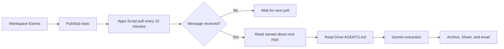
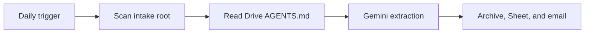

# Operations and Troubleshooting Guide

This guide covers one deployed cataloger instance. Use the separate
[installation guide](INSTALLATION.md) for first-time provisioning.

## Contents

- [Architecture](#architecture)
- [Installation and first validation](#installation-and-first-validation)
- [Configuration reference](CONFIGURATION.md)
- [Cadence and cost](#cadence-and-cost)
- [Use cases](#use-cases)
- [Operations](#operations)
- [Observability](#observability)
- [Troubleshooting](#troubleshooting)
- [Secrets and cost controls](#secrets-and-cost-controls)

## Architecture

The event path receives a Drive file ID and processes only the matching PDF
when it is directly in the intake root.



The daily path is the independent safety net.



## Installation and first validation

For a new instance:

```bash
make install-check
make install
```

Complete the printed browser handoff and
[resume the installer](INSTALLATION.md#quick-start). The installer configures
Script Properties, policy, spreadsheet, Pub/Sub, Drive events, and all three
triggers, then validates the resulting state.

Use the [controlled validation](INSTALLATION.md#controlled-validation) before
pausing any prior automation. Do not run `runDailyUtilitiesCataloging` or
`processDriveEventQueue` as a harmless test: either may process intake PDFs.

The event subscription requests Google's maximum available TTL. Keep the
six-hour `renewDriveEventSubscription` trigger enabled; it checks live state
and renews within 12 hours of expiry. If the stored subscription is confirmed
missing, renewal creates a replacement; ownership or topology conflicts still
stop for manual review. Events may cover descendants, but the cataloger still
processes only direct-root PDFs.

## Cadence and cost

`Config.gs` sets `EVENT_POLL_MINUTES` to `15`. Change it only in source and
redeploy the Apps Script project; then run `installAutomationTriggers` to
replace the existing poll trigger.

| Choice | Effect |
| --- | --- |
| Keep 15 minutes | Lower trigger quota use; processing may wait up to 15 minutes. |
| Use a longer interval | Lower trigger and URL Fetch quota use; processing may wait up to the interval. |

The interval does not change how many Drive events are published or the
associated Pub/Sub message volume. Apps Script has no per-execution price, and
Pub/Sub bills throughput after its monthly free allowance. For low invoice
volume, extending the interval normally saves no material money. Keep the daily
fallback enabled at every interval.

## Use cases

| Situation | Action | Expected behavior |
| --- | --- | --- |
| First installation | Follow [controlled validation](INSTALLATION.md#controlled-validation). | No prior automation is disabled. |
| New PDF created, moved in, or changed | Wait for event path. | Usually processed within 15 minutes. |
| Event not received | Wait for daily trigger. | Daily scan catches direct intake PDFs. |
| PDF is unchanged after `NEEDS REVIEW` or `DUPLICATE` | No action. | It is not sent to Gemini again until the file changes or is manually processed. |
| Gemini Developer API Free Tier daily quota is exhausted | Wait for automatic Vertex fallback, the next daily fallback, or increase Gemini quota. | With automatic fallback enabled, the current PDF retries once on Vertex and the runtime returns to Free Tier after one hour. |
| Gemini Developer API prepayment credits are depleted | Replenish credits or leave automatic Vertex fallback enabled. | The current PDF switches to Vertex and later PDFs use Vertex for one hour; generic short-lived `429` limits do not switch. |
| Change suppliers or folders | Edit `config.local.json`, then replace `AUTOMATION_CONFIG_JSON`. | New rules apply on the next run. |
| Change per-document instructions | Edit Drive `AGENTS.md`. | The next eligible PDF run reads it. |
| Pause safely | Run `removeAutomationTriggers`. | No triggers run; existing files and Sheet rows remain unchanged. |

Each normally processed PDF uses one Gemini generation request. Transient
network, `408`, generic `429`, and selected `5xx` failures receive one bounded
retry. A verified Gemini Developer API daily-quota or depleted-prepayment
response instead retries once on Vertex when automatic fallback is enabled.
Unchanged completed, duplicate, or review documents are not resubmitted on
each event.

## Operations

| Function | When to use it | Effect |
| --- | --- | --- |
| `runDailyUtilitiesCataloging` | Scheduled daily fallback only. | Scans and may process PDFs. |
| `processSingleIntakeFile(fileId)` | Controlled single-file test. | May process that intake PDF. |
| `processDriveEventQueue` | 15-minute trigger only. | Pulls events and processes only direct-root PDFs named by those events. |
| `renewDriveEventSubscription` | Six-hour trigger only. | Extends the active Drive event subscription when due. |
| `provisionDriveEventTransport` | Initial setup. | Ensures Pub/Sub and Drive event resources exist without replacing an active Drive event subscription. |
| `recreateDriveEventSubscription` | Event repair after a controlled test receives no event. | Replaces only this automation's Drive event subscription; keeps the Pub/Sub topic and pull subscription. |
| `removeAutomationTriggers` | Pause or retirement. | Deletes only this project's automation triggers. |

After a transport repair, run `installAutomationTriggers` to restore all three
triggers. It removes and recreates only the cataloger's matching triggers.

### CLI health check

Use Cloud Logging to check the deployed automation without invoking any Apps
Script function or broadening OAuth access:

```sh
gcloud logging read \
  'jsonPayload.component="drive-utilities-cataloger"' \
  --project="${PROJECT_ID}" \
  --limit=10 \
  --order=desc
```

Run `getSetupStatus` from the Apps Script editor when a read-only configuration
check is required. Do not invoke a processing function unless testing a
controlled intake PDF: it can rename, move, import, or email a report.

## Observability

Use the **Executions** page for trigger health and Cloud Logging for the
per-file outcome. An empty 15-minute poll emits only the run start and
completion events with zero results; it has no file or Gemini event.

The representative structured event sequences are:

```text
catalog-run-start
catalog-scan-completed               (daily path)
drive-event-received                 (event path)
catalog-file-processing-start        (once per direct-root PDF)
gemini-generation-request
gemini-generation-response
catalog-file-processing-completed    (file ID and status)
report-email-send-start
report-email-sent
drive-event-acknowledged             (event path)
catalog-run-completed
```

Some entries are absent when no file is eligible or a pending email is flushed
at run start. The per-file completion event contains only the Drive file ID and
status. Logs deliberately exclude filenames, credentials, recipients, document
text, and extracted invoice values. A `catalog-run-skipped` event means another
run already held the processing lock; it made no changes.

Every structured log event, setup-status response, and per-file email report
includes the running `MAJOR.MINOR.PATCH` application version. This identifies
the exact source version that processed a PDF even when email delivery is
retried later from the durable outbox.

Apps Script can take a short time to display log entries. For a reliable view,
open **View in Cloud Logging** from an execution, or query the linked Cloud
project:

```bash
gcloud logging read \
  'jsonPayload.component="drive-utilities-cataloger"' \
  --project="${PROJECT_ID}" \
  --limit=50 \
  --order=desc \
  --format='table(timestamp,severity,jsonPayload.event,jsonPayload.fileId,jsonPayload.status,jsonPayload.resultCount)'
```

Logs are written only after the source version containing this observability
feature is deployed; they cannot reconstruct earlier executions.

Before changing a file, the runtime records a durable `PROCESSING` lease.
Successful outcomes and email bodies are persisted before delivery. A
per-file mutation journal lets the next run compensate an interrupted Sheet,
rename, or move operation. If the recorded Sheet row cannot be identified
uniquely, recovery stops and reports a manual-review error instead of deleting
data. A hard stop before the source marker is written can leave one unmarked
row at the planned position; recovery reports it without deleting an
unprovenanced row.

## Troubleshooting

| Symptom | Likely cause | Recovery |
| --- | --- | --- |
| Pub/Sub says the consumer project is disabled | Apps Script still uses its default Cloud project. | Link the intended standard Cloud project number, then reauthorize. |
| Consent blocks execution or authorization expires | OAuth audience is not durable for the operator. | Use Internal, a Workspace Trusted override, or External/In production; then reauthorize and run `getSetupStatus`. |
| Daily works but event path does not | Event subscription is stale or transport is absent. | Run `provisionDriveEventTransport`; if a fresh controlled PDF still produces no event, run `recreateDriveEventSubscription`, then reinstall triggers. |
| A completed 15-minute poll has no file outcome | No eligible Pub/Sub message was available. | This is expected; add or change a controlled direct-root PDF, then check the next eventful run. |
| An eventful run stops before a file outcome | A failure occurred before processing, or Cloud Logging is delayed. | Open the execution in Cloud Logging and follow the structured event sequence. |
| Nothing is processed | No direct-root PDF, or `AGENTS.md` is missing, duplicated, invalid, or oversized. | Correct the intake folder; do not move PDFs into subfolders to retry. |
| A document is left untouched | Data, destination, or reconciliation is ambiguous. | Resolve the single reported problem and rerun with a controlled file. |
| `catalog-mutation-recovery-failed` appears once and the PDF remains blocked | A journaled Drive or Sheet mutation cannot be proven safe to compensate. | Reconcile the file and source-marked row manually; delete that file's `MUTATION_JOURNAL_` and `MUTATION_RECOVERY_ALERT_` Script Properties only after verification. |
| A PDF larger than 35 MiB is rejected | Base64 plus the request envelope would exceed the Apps Script URL Fetch limit. | Produce a smaller PDF without changing invoice content. |

`gemini-generation-request` is emitted once for each outbound model request.
Count this event by file ID to detect retries or redundant processing; a normal
file has one request and one `gemini-generation-response` event.

Each successful response also emits `gemini-generation-usage`. It records the
provider-reported `promptTokenCount`, `candidatesTokenCount`,
`thoughtsTokenCount`, and `totalTokenCount` for that file. With the current
Vertex AI `gemini-2.5-flash` runtime it also includes `estimatedCostUsd` and
its input and output components, calculated from the list prices
encoded in `Config.gs`. This is an operational estimate, not an invoice:
Cloud Billing remains authoritative and can lag behind the execution logs.

```bash
gcloud logging read \
  'jsonPayload.event="gemini-generation-usage" AND jsonPayload.fileId="FILE_ID"' \
  --project="${PROJECT_ID}" \
  --limit=10 \
  --order=desc \
  --format=json
```

## Secrets and cost controls

- Save a Gemini Developer API key in a password manager; do not store it in
  Git, `config.local.json`, `AGENTS.md`, documentation, or issue trackers.
- Vertex AI uses the Apps Script OAuth identity and does not require an API key.
- Treat Script Properties as private runtime configuration.
- Set a Cloud billing budget and alerts before enabling events.
- Gemini and Pub/Sub usage is typically small for utility invoices, but quotas,
  tiers, and prices vary by account and model.
