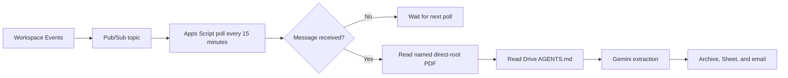
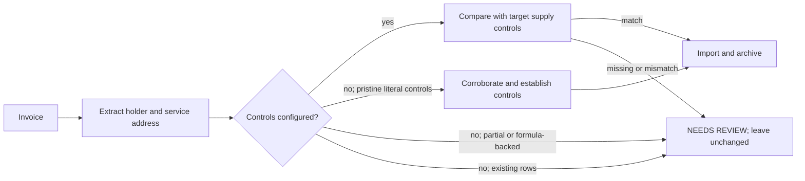

# Operations and Troubleshooting Guide

This guide covers one deployed cataloger instance. Use the separate
[installation guide](INSTALLATION.md) for first-time provisioning.

## Contents

- [Architecture](#architecture)
- [Installation and first validation](#installation-and-first-validation)
- [Supply identity controls](#supply-identity-controls)
- [Reconfigure time zone](#reconfigure-time-zone)
- [Event transport identity](#event-transport-identity)
- [Release validation evidence](#release-validation-evidence)
- [Configuration reference](CONFIGURATION.md)
- [Cadence and cost](#cadence-and-cost)
- [Use cases](#use-cases)
- [Operations](#operations)
- [Observability](#observability)
- [Troubleshooting](#troubleshooting)
- [Secrets and cost controls](#secrets-and-cost-controls)

## Architecture

The event path receives a Drive file ID and processes only the matching PDF
when it is directly in the intake root.



The daily path is the independent safety net.


## Supply identity controls

Invoice ownership is checked after extraction and before any Drive or Sheet
mutation:



The comparison is independent of supplier, contract number, and customer code,
so changing provider does not require carrying identifiers between suppliers.
It normalizes case, punctuation, whitespace, line breaks, and common Italian
street abbreviations, then requires the account-holder name plus street, civic
number, and city. CAP and field order are not required. The raw printed holder
and address are stored on each imported row for auditability.

New controls display localized placeholder text with an amber background and
prominent border. They turn green when configured. On a tab with no imported
rows, the first valid invoice may establish both controls after its structured
street, civic number, and city are corroborated against the printed address
evidence.

For existing installations, run `migrateCatalogerServiceIdentityFields` once
from the Apps Script editor after deployment. Fill the control values in each
supply tab's metadata row when the tab already contains invoices. Existing
history, partial values, and formula-backed blanks remain fail-closed and cause
`NEEDS REVIEW`; the importer does not infer a baseline retroactively.

The migration preserves charts already attached to source supply tabs. For
electricity, the existing managed dashboard refresh runs after all source tabs
are migrated; its header-alias lookup continues to find date, consumption, and
cost fields after the two identity columns are inserted.

## Installation and first validation

For a new instance:

```bash
make install-check
make install
```

Complete the printed browser handoff and
[resume the installer](INSTALLATION.md#quick-start). The installer configures
Script Properties, policy, spreadsheet, Pub/Sub, Drive events, and all three
triggers, then validates the resulting state.

Use the [controlled validation](INSTALLATION.md#controlled-validation) before
pausing any prior automation. Do not run `runDailyUtilitiesCataloging` or
`processDriveEventQueue` as a harmless test: either may process intake PDFs.

The event subscription requests Google's maximum available TTL by omitting the
TTL during creation and using the documented zero-TTL patch during renewal.
Keep the six-hour `renewDriveEventSubscription` trigger enabled; it checks live
state and renews within 12 hours of expiry. If the stored subscription is
confirmed missing or Google explicitly reports `SUBSCRIPTION_ACCESS_DENIED`,
renewal creates a replacement. Generic permission failures and ownership or
topology conflicts still stop for manual review. Events may cover descendants,
but the cataloger still processes only direct-root PDFs.

## Reconfigure time zone

Set `time_zone` in `config.local.json`, then run:

```bash
make install-reconfigure-time-zone
```

The command discovers the saved Desktop OAuth client under
`$HOME/.config/gduc/` automatically. Set `GDUC_OAUTH_CLIENT_JSON` only when
using a different client path.

This narrow operation updates the Apps Script and spreadsheet time zone plus
the persisted installer and runtime configuration. It preserves Gemini
credentials, triggers, event transport, and enabled processing state. Use
`GDUC_TIME_ZONE` only for a temporary command-level override. Full behavior and
rollback details are in the
[installation guide](INSTALLATION.md#reconfigure-time-zone).
Installations using `GDUC_STATE_DIR` must export the same path here.

## Event transport identity

The supported topic and pull subscription names include the current Apps
Script ID. Provisioning accepts either an entirely unconfigured pair or the
exact script-scoped pair. Provisioning, repair, and renewal reject partial,
generic, foreign, or mistyped names instead of overwriting or treating them as
a compatibility transport. Verify the only active cataloger resources are the
script-scoped pair:

```bash
SCRIPT_ID="$(jq -er '.scriptId' .clasp.json)"
PROJECT_ID="$(jq -er '.projectId' .clasp.json)"
gcloud pubsub topics describe \
  "drive-utilities-events-${SCRIPT_ID}" --project="${PROJECT_ID}"
gcloud pubsub subscriptions describe \
  "drive-utilities-events-pull-${SCRIPT_ID}" --project="${PROJECT_ID}"
```

Release `0.1.0` does not support or automatically migrate legacy, generic, or
mismatched names. An entirely absent pair can be provisioned with
`provisionDriveEventTransport`; a partial or mismatched pair fails closed. No
in-place migration procedure is provided in this release. Use a fresh
installation, or design and review a one-off migration before changing remote
resources. Do not change Script Properties alone.

## Release validation evidence

The `0.1.0` controlled validation on 2026-07-18 observed the complete event
path on the script-scoped transport: Workspace event receipt, one eligible PDF,
Gemini `STOP`, Sheet import, canonical Drive move, and `IMPORTED` completion.
The exact test row and PDF were then deleted and verified absent. The obsolete
generic Pub/Sub topic and pull subscription were removed, the script-scoped
pair remained `ACTIVE`, and final installation validation completed. No test
document identifiers, installation IDs, or extracted private values are kept
in this repository.

On 2026-07-31, the `0.3.1` supplier-profile, ownership, literal-value,
reference-month, and reconciliation policy changes were applied to the existing
Drive `AGENTS.md` and read back successfully. The update preserved the
installation-specific policy content and did not deploy source code or alter
processing triggers.

On 2026-08-01, the existing Drive `AGENTS.md` was updated and read back
successfully to require explicit absence evidence before the reviewed ILIAD
`Spese d'incasso` zero default can apply, retain a printed zero as a printed
value, and leave unreadable or ambiguous charges for review. The conflicting
reference-month wording was corrected to require literal `mm` text (`01`
through `12`). This operational policy update did not deploy source code or
alter processing triggers.

On 2026-08-09, the 2026-08-08 authorization for warning-only missing cadence
and secondary fields was withdrawn from both the source policy and the live
Drive `AGENTS.md` in the configured intake folder. The Drive API read-back
matched the uploaded policy exactly. No PDF, spreadsheet, trigger, or source
deployment was changed by this policy update.

## Cadence and cost

`Config.gs` sets `EVENT_POLL_MINUTES` to `15`. Change it only in source and
redeploy the Apps Script project; then run `installAutomationTriggers` to
refresh the managed trigger when its stored schedule differs. On the first
post-upgrade run, the cataloger records existing triggers as the schedule
baseline without recreating them.

| Choice | Effect |
| --- | --- |
| Keep 15 minutes | Lower trigger quota use; processing may wait up to 15 minutes. |
| Use a longer interval | Lower trigger and URL Fetch quota use; processing may wait up to the interval. |

The interval does not change how many Drive events are published or the
associated Pub/Sub message volume. Apps Script has no per-execution price, and
Pub/Sub bills throughput after its monthly free allowance. For low invoice
volume, extending the interval normally saves no material money. Keep the daily
fallback enabled at every interval.

## Use cases

| Situation | Action | Expected behavior |
| --- | --- | --- |
| First installation | Follow [controlled validation](INSTALLATION.md#controlled-validation). | No prior automation is disabled. |
| New PDF created, moved in, or changed | Wait for event path. | Usually processed within 15 minutes. |
| Event not received | Wait for daily trigger. | Daily scan catches direct intake PDFs. |
| PDF is unchanged after `NEEDS REVIEW` or `DUPLICATE` | No action. | It is not sent to Gemini again until the file changes or is manually processed. |
| Gemini Developer API Free Tier daily quota is exhausted | Wait for automatic Vertex fallback, the next daily fallback, or increase Gemini quota. | With automatic fallback enabled, the current PDF retries once on Vertex and the runtime returns to Free Tier after one hour. |
| Gemini Developer API prepayment credits are depleted | Replenish credits or leave automatic Vertex fallback enabled. | The current PDF switches to Vertex and later PDFs use Vertex for one hour; generic short-lived `429` limits do not switch. |
| Change suppliers or folders | Edit `config.local.json`, then replace `AUTOMATION_CONFIG_JSON`. | New rules apply on the next run. |
| Change per-document instructions | Edit Drive `AGENTS.md`. | The next eligible PDF run reads it. |
| Pause safely | Run `removeAutomationTriggers`. | No triggers run; existing files and Sheet rows remain unchanged. |

Each normally processed PDF uses one Gemini generation cycle. When
deterministic validation finds repairable document-data problems, it can request
at most two additional targeted cycles, for a maximum of three. Each repair
prompt contains structured issue codes and fields, the previous schema-valid
extraction when available, and prior-attempt history; it asks for another
complete schema object rather than a partial patch. Configuration or
spreadsheet-state errors stop without spending another model call. A repair is
also deferred when the shared Apps Script runtime budget is nearly exhausted,
so the file can retain a retryable outcome. The model can revise extracted data
and evidence but cannot change validation or import policy.
Repairs preserve monetary fields only after their relevant validators pass and
the next failure leaves that group unaffected. Identity, period, and disputed
amounts remain eligible for correction; a conflicting inferred frequency reopens the printed period
and reference-date fields for re-examination. Neither condition relaxes the
final reconciliation or historical-frequency checks.
Structured logs record each validation outcome, targeted repair request,
successful repair, and exhausted three-call loop using only file ID, attempt
counts, validation stage, and issue code; extracted document values are not
logged. These events provide the evidence needed to decide later whether a
separate AI prompt supervisor would add value.

Transient network, `408`, generic `429`, and selected `5xx` failures receive
one bounded transport retry. A verified Gemini Developer API daily-quota or
depleted-prepayment response instead retries once on Vertex when automatic
fallback is enabled. Those outbound provider attempts remain distinct from the
three logical extraction cycles and are counted at the request boundary.
Unchanged completed, duplicate, or review documents are not resubmitted on
each event. Both model backends receive the same JSON Schema in addition to the
JSON MIME type; application validation still checks dates, totals, configured
headers, and business rules before any Drive or Sheet mutation. Recognized
unit-rate and consumption strings normalize to numbers during extraction.
Other supplementary numeric strings convert for recognized quantitative
headers independently of cell formatting. Identifier and unknown-header text
remains literal; ambiguous monetary, consumption, and unit-rate grouping is
rejected. Native numeric rates and unambiguous high-precision rate strings keep
their precision. Three-digit groups separated by spaces, nonbreaking spaces,
or narrow nonbreaking spaces are accepted; malformed grouping remains blocking.
Readback verification requires literal text cells for identifiers and reference
periods and preserves rate and quantity precision. Informational diagnostics
must match a complete supported statement; additional blocking clauses remain
unresolved. Ordinary field-label colons and supported affirmative VAT wording
remain informational. Supplier defaults apply only to the matching supplier
and supply; other invoices retain generic optional-field handling. A verified
absent detail contributes no amount to a fully configured cost partition, whose
remaining values must still reconcile. A malformed repair cannot replace the
last sanitized extraction.
Credential rotation through `rotateGeminiDeveloperApiKeyFromSecret` requires a
handoff from the installed Cloud project and validates the new key against the
configured model. It changes only the key, preserving the backend, model,
paid-fallback opt-in, and cooldown. Backend changes use the separate
`configureGeminiBackend` function.

Reference years and months are written as literal text. Run the idempotent
owner-only `migrateCatalogerReferencePeriodText` function after this release
to normalize existing imported rows; it skips formula-backed cells and does
not change other columns.
Post-write verification requires the exact text month, such as `06`, in both
the native cell value and displayed text. Rollback restores the original
snapshot, including any historical numeric period cells. When verification
fails, the recipient report includes the field and expected and observed values
(plus a money tolerance where applicable). Other failures report the phase,
reason, and recommended action rather than inventing a comparison.

## Operations

| Function | When to use it | Effect |
| --- | --- | --- |
| `runDailyUtilitiesCataloging` | Scheduled daily fallback only. | Scans and may process PDFs. |
| `retryFailedUtilitiesCataloging` | Owner-controlled recovery after a fixed configuration or runtime error. | Retries only direct-root PDFs whose latest outcome is `ERROR`, including errors recorded today. |
| `processSingleIntakeFile(fileId)` | Controlled single-file automatic import; accepts only a PDF file ID. | Processes that intake PDF through extraction, validation, and journaled import. |
| `previewUtilityInvoiceExtraction(fileId)` | Automatically extract and validate an intake or archived PDF within the configured root. | Uses the normal model/repair pipeline and quota accounting, without importing or changing the PDF. |
| `processSingleIntakeFileByName(fileName)` | Owner-controlled recovery when the exact intake filename is known. | Resolves one direct-root PDF by exact name and delegates to `processSingleIntakeFile`; missing or ambiguous matches fail closed. |
| `migrateCatalogerReferencePeriodText` | One-time or repeatable post-release maintenance. | Converts existing non-formula reference year/month cells to literal text without changing other fields. |
| `processDriveEventQueue` | 15-minute trigger only. | Validates the script-scoped transport before pulling events, then processes only direct-root PDFs named by those events; an absent pair is a no-op and a mismatch fails closed. |
| `renewDriveEventSubscription` | Six-hour trigger only. | Extends the active subscription or replaces an explicitly inaccessible stored subscription; an absent transport is a no-op and mismatched Pub/Sub names fail closed. |
| `provisionDriveEventTransport` | Initial setup. | Ensures Pub/Sub and Drive event resources exist without replacing an active Drive event subscription. |
| `recreateDriveEventSubscription` | Event repair after a controlled test receives no event. | Reconciles script-scoped Pub/Sub resources and replaces this automation's Drive event subscription. |
| `removeAutomationTriggers` | Pause or retirement. | Deletes only this project's automation triggers. |

For invoices whose billing frequency is not printed explicitly, the runtime may
derive `monthly`, `bimonthly`, or `quarterly` from a complete calendar or
anniversary-aligned billed period, or from verified independent earlier invoices
for the same supplier and supply. A unique historical majority is required when
history is used. Conflicting, unavailable, or insufficient evidence leaves a
blocking diagnostic; it never copies a transaction-specific value from another
invoice. An explicit printed frequency or reviewed configuration override
remains authoritative.

On 2026-09-05, the live Drive policy was updated to return null cadence and
provenance when cadence is unprinted, without reporting that absence alone as
a problem. It now explicitly distinguishes the current billed consumption
period from offer-validity, cumulative-spending, and historical periods.
The separately uploaded policy was verified by an exact byte-for-byte read-back;
conflicting or unreadable printed periods remain blocking.
The same day's reviewed policy update also reserves `problems` for unresolved
document issues rather than explanations of successful mappings. Its separate
Drive upload was verified byte for byte. Numeric unit-cost normalization accepts
plain rates and recognized euro-per-unit suffixes only in localized unit-cost
headers; ambiguous prose is rejected before import, and identifiers stay text.

The 2026-09-05 regression run automatically reimported five Energygas electricity
PDFs and five OENERGY gas PDFs through the normal journaled pipeline on Vertex
AI. Existing literal row values were cleared and replaced from fresh extraction;
no operator-supplied extraction payload was accepted. An independent final Sheets
and Drive read verified all ten invoice identities, numeric amounts and unit
rates, literal reference years/months, calculation formulas, unchanged PDF bytes,
and the configured archive destinations. No PDFs remained in intake. Older gas
PDFs previously stored directly under the supplier folder were archived into its
configured year folder, and source links were refreshed accordingly.
The subsequent Developer API generation probe still returned HTTP 503 for high
demand; successful Vertex imports do not establish Developer API availability.
On 2026-09-06, another real PDF probe confirmed the same Developer API 503.
With explicit owner authorization, the installation was switched persistently
to `vertex_ai`, retaining `gemini-flash-latest` and the Developer API credentials.
This settings-only change does not alter the automatic paid-fallback criteria.
The fresh ten-invoice Sheets/Drive audit passed again, with no intake PDFs;
deployment 84, project HEAD, and the reviewed live policy remained unchanged.
Fresh read-only extraction previews of the latest gas and electricity PDFs
passed on the retained Vertex backend, matching the reviewed numeric values
without operator-supplied extraction (three and two model calls respectively,
including automatic repair). The full `make check` suite also passed.
Private snapshots and reproducible audit scripts are retained under the ignored
`.installer/validation/automatic-reimport-20260905/` directory, not published with
the source repository.

Explicit absence or non-applicability of a configured writable secondary field
is non-blocking only after monetary reconciliation and only when the matching
normalized `sheet_values` entry is omitted or exactly `null`. Unreadable,
ambiguous, non-null, or duplicate evidence blocks import. The narrow reviewed
subscriber-identifier, tax-inclusion, and supplier-default exceptions remain in
force. `IMPORTED WITH WARNINGS` is reserved for a retained import whose
electricity dashboard refresh failed.

Cadence reported by extraction is trusted only with explicit printed
provenance. Reviewed configuration overrides remain authoritative, while
period/history inference stays limited to supported canonical cadence values.
Invalid provenance or unsupported unproven model text blocks import.

Dashboard refresh recovery clears its pending marker only after an explicit
terminal refresh result or a reviewed non-applicable result. Missing mappings,
missing sources, and invalid unmanaged no-op states remain deferred and retain
the marker. A marker-write failure is logged best-effort and cannot roll back a
verified invoice row.

On 2026-08-09, these runtime-policy changes were applied to the live Drive
`AGENTS.md` in the configured intake folder. A Drive API read-back matched the
uploaded policy byte for byte and confirmed the cadence-provenance and
secondary-field rules. No PDF, spreadsheet, trigger, or deployment was
changed.

Later on 2026-08-09, the same live policy was extended with the bounded
validator-guided repair-loop contract. The Drive API upload and read-back both
succeeded, the files matched byte for byte, and the two-repair limit was
confirmed. No PDF, spreadsheet, trigger, or deployment was changed.

The electricity dashboard and its technical sheet are derived presentation
state. A refresh failure is logged and reported as an import warning after the
invoice row has been verified; it never rolls back valid invoice data. The next
scheduled daily or Drive-event run retries the managed refresh even when no
new PDF is eligible, and clears the pending dashboard-recovery state only after
that refresh succeeds.

When a report contains the localized supplier-profile link, open that folder to
review a pending profile or the approved profile. The localized retry-import
link opens the Apps Script project at
`retryFailedUtilitiesCataloging`; it is deliberately an owner-controlled manual
execution, not a public retry endpoint.

After a transport repair, run `installAutomationTriggers` to restore all three
triggers. It preserves matching schedules, removes duplicates, and refreshes
only handlers whose stored cadence differs from the deployed source.

### CLI health check

Use Cloud Logging to check the deployed automation without invoking any Apps
Script function or broadening OAuth access:

```sh
gcloud logging read \
  'jsonPayload.component="drive-utilities-cataloger"' \
  --project="${PROJECT_ID}" \
  --limit=10 \
  --order=desc
```

Run `getSetupStatus` from the Apps Script editor when a read-only configuration
check is required. Do not invoke a processing function unless testing a
controlled intake PDF: it can rename, move, import, or email a report.

## Observability

Use the **Executions** page for trigger health and Cloud Logging for the
per-file outcome. An empty 15-minute poll emits only the run start and
completion events with zero results; it has no file or Gemini event.

The representative structured event sequences are:

```text
catalog-run-start
catalog-scan-completed               (daily path)
drive-event-received                 (event path)
catalog-file-processing-start        (once per direct-root PDF)
gemini-generation-request
gemini-generation-response
catalog-file-processing-completed    (file ID and status)
report-email-send-start
report-email-sent
drive-event-acknowledged             (event path)
catalog-run-completed
```

Some entries are absent when no file is eligible or a pending email is flushed
at run start. The per-file completion event contains only the Drive file ID and
status. Logs deliberately exclude filenames, credentials, recipients, document
text, and extracted invoice values. A `catalog-run-skipped` event means another
run already held the processing lock; it made no changes.

Every structured log event, setup-status response, and per-file email report
includes the running `MAJOR.MINOR.PATCH` application version. This identifies
the exact source version that processed a PDF even when email delivery is
retried later from the durable outbox.

When a later Drive or spreadsheet step fails after Gemini has returned a valid
extraction, the configured-recipient email preserves that extracted snapshot
as **available, not imported**. It also names the failed phase, confirms
whether the extraction reconciliation passed, and reports rollback state. A
formula-total mismatch also reports the formula column, expected value, observed
value, and tolerance so the spreadsheet template can be diagnosed after the
rollback. The
corresponding Cloud Logging event carries the opaque file ID, error type and
category, failure stage, and standard event/component/version metadata; it
never includes extracted values.

Apps Script can take a short time to display log entries. For a reliable view,
open **View in Cloud Logging** from an execution, or query the linked Cloud
project:

```bash
gcloud logging read \
  'jsonPayload.component="drive-utilities-cataloger"' \
  --project="${PROJECT_ID}" \
  --limit=50 \
  --order=desc \
  --format='table(timestamp,severity,jsonPayload.event,jsonPayload.fileId,jsonPayload.status,jsonPayload.resultCount)'
```

Logs are written only after the source version containing this observability
feature is deployed; they cannot reconstruct earlier executions.

Before changing a file, the runtime records a durable `PROCESSING` lease.
Successful outcomes and email bodies are persisted before delivery. A
per-file mutation journal lets the next run compensate an interrupted Sheet,
rename, or move operation. If the recorded Sheet row cannot be identified
uniquely, recovery stops and reports a manual-review error instead of deleting
data. A hard stop before the source marker is written can leave one unmarked
row at the planned position; recovery reports it without deleting an
unprovenanced row.

## Troubleshooting

| Symptom | Likely cause | Recovery |
| --- | --- | --- |
| Pub/Sub says the consumer project is disabled | Apps Script still uses its default Cloud project. | Link the intended standard Cloud project number, then reauthorize. |
| Consent blocks execution or authorization expires | OAuth audience is not durable for the operator. | Use Internal, a Workspace Trusted override, or External/In production; then reauthorize and run `getSetupStatus`. |
| Daily works but event path does not | Event subscription is stale or transport is absent. | Run `provisionDriveEventTransport`; if a fresh controlled PDF still produces no event, run `recreateDriveEventSubscription`, then reinstall triggers. |
| A completed 15-minute poll has no file outcome | No eligible Pub/Sub message was available. | This is expected; add or change a controlled direct-root PDF, then check the next eventful run. |
| An eventful run stops before a file outcome | A failure occurred before processing, or Cloud Logging is delayed. | Open the execution in Cloud Logging and follow the structured event sequence. |
| Nothing is processed | No direct-root PDF, or `AGENTS.md` is missing, duplicated, invalid, or oversized. | Correct the intake folder; do not move PDFs into subfolders to retry. |
| A document is left untouched | Data, destination, or reconciliation is ambiguous. | Resolve the single reported problem and rerun with a controlled file. |
| `catalog-mutation-recovery-failed` appears once and the PDF remains blocked | A journaled Drive or Sheet mutation cannot be proven safe to compensate. | Reconcile the file and source-marked row manually; delete that file's `MUTATION_JOURNAL_` and `MUTATION_RECOVERY_ALERT_` Script Properties only after verification. |
| Recovery reports `Service-identity controls changed since the interrupted import` | An operator edited the holder or service-address control after the interruption. | Reconcile the two controls with the source row and invoice first; only then clear that file's journal/alert properties and retry. Never clear the journal while the source row or controls are unresolved. |
| A PDF larger than 35 MiB is rejected | Base64 plus the request envelope would exceed the Apps Script URL Fetch limit. | Produce a smaller PDF without changing invoice content. |

`gemini-generation-request` is emitted once for each outbound model request.
Count this event by file ID to detect retries or redundant processing; a normal
file has one request and one `gemini-generation-response` event. A successful
response also records the provider `finishReason`: Vertex requires `STOP`, and
Interactions requires root status `completed` (logged as `COMPLETED`). Other
statuses fail before parsing or mutating Drive and Sheets.

Each successful response also emits `gemini-generation-usage`. It records the
provider-reported `promptTokenCount`, `candidatesTokenCount`,
`thoughtsTokenCount`, and `totalTokenCount` for that file. When the selected
Vertex model has a price table encoded in `Config.gs`, the event also includes
`estimatedCostUsd` and its input and output components. This is an operational
estimate, not an invoice: Cloud Billing remains authoritative and can lag
behind the execution logs.
The default `gemini-flash-latest` Developer API runtime uses Google's
Interactions API with explicit `medium` thinking, an 8,192-token JSON response
budget, the shared JSON Schema contract, and `store:false` for stateless invoice
processing. Vertex AI continues to use `generateContent` with the same alias
and output budget plus an explicit `thinkingBudget: 4096` to retain reasoning
for aggregate and subordinate invoice cost rows. Vertex receives the shared
extraction contract converted to its OpenAPI-style `responseSchema`. The alias
may resolve to a newer Flash release without a source or Script Properties
update.
The Interactions parser follows Google's current
[REST steps schema](https://ai.google.dev/gemini-api/docs/interactions-breaking-changes-may-2026),
which replaced legacy `outputs`; a completed response can omit per-step status.
Vertex schema conversion preserves nullable enums, mixed primitive value types,
and reference-month patterns using the supported
[Schema fields](https://docs.cloud.google.com/vertex-ai/generative-ai/docs/reference/rest/v1/Schema).
Until a verified Vertex price is added to `Config.gs`, usage events for the
alias and other unpriced models retain provider token counts but intentionally
omit cost-estimate fields; Cloud Billing remains authoritative.

If the Developer API returns a transient outage such as HTTP 503 and imports
must be recovered immediately, an owner may use `configureGeminiBackend` to
select the configured Vertex AI backend and run the controlled retry. Restore
`gemini_api` after temporary recovery unless the owner explicitly authorizes
keeping Vertex AI active with usage-based billing. Do not turn a status code
alone into automatic paid-backend fallback.

```bash
gcloud logging read \
  'jsonPayload.event="gemini-generation-usage" AND jsonPayload.fileId="FILE_ID"' \
  --project="${PROJECT_ID}" \
  --limit=10 \
  --order=desc \
  --format=json
```

## Secrets and cost controls

- Save a Gemini Developer API key in a password manager; do not store it in
  Git, `config.local.json`, `AGENTS.md`, documentation, or issue trackers.
- Vertex AI uses the Apps Script OAuth identity and does not require an API key.
- Treat Script Properties as private runtime configuration.
- Set a Cloud billing budget and alerts before enabling events.
- Gemini and Pub/Sub usage is typically small for utility invoices, but quotas,
  tiers, and prices vary by account and model.
