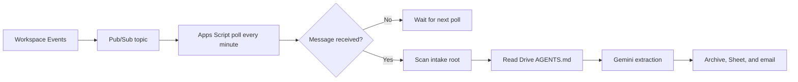
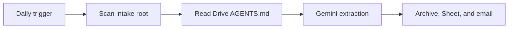

# Operations Runbook

This runbook installs and operates one private instance of the cataloger.
Keep the existing automation enabled until a controlled test proves this one.

## Contents

- [Architecture](#architecture)
- [Install](#install)
- [Configure](#configure)
- [Activate and validate](#activate-and-validate)
- [Cadence and cost](#cadence-and-cost)
- [Use cases](#use-cases)
- [Operations](#operations)
- [Troubleshooting](#troubleshooting)
- [Secrets and cost controls](#secrets-and-cost-controls)

## Architecture

The event path signals a scan; it does not process the event payload directly.



The daily path is the independent safety net.



## Install

This is the setup path for a new Google account or Cloud project.

```mermaid
flowchart LR
  accTitle: Initial installation path
  accDescr: Creates the Cloud and Apps Script setup before any automation is enabled.
  cloud["Create Cloud project"] --> apis["Enable required APIs"]
  apis --> oauth["Configure OAuth testing"]
  oauth --> key["Create Gemini API key"]
  key --> script["Create Apps Script project"]
  script --> link["Link standard Cloud project"]
  link --> auth["Authorize Apps Script"]
  auth --> config["Set Script Properties"]
```



1. Create a standard Google Cloud project with billing enabled.
2. Enable Drive, Sheets, Pub/Sub, Workspace Events, Gemini, and Apps Script
   APIs.
3. Configure OAuth as External / Testing and add the operator as a test user.
4. Create a Gemini API key and save it in a password manager.
5. Create the standalone Apps Script project, upload the source and manifest,
   then set its time zone.
6. In **Project Settings**, change from the Apps Script default Cloud project
   to the standard Cloud project number.
7. Run `getSetupStatus` and complete the Google authorization flow.

Changing the linked Cloud project revokes the existing Apps Script grants.
Reauthorize immediately after the change. It affects only this Apps Script
project, not other Apps Script projects in the same account.

## Configure

Create the private local configuration first:

```sh
cp config.example.json config.local.json
jq empty config.local.json
```

Edit every placeholder in `config.local.json`. It stays in the repository root,
is ignored by Git and clasp, and is never uploaded as a file. Copy its complete
JSON text into the `AUTOMATION_CONFIG_JSON` Script Property.

Set these Script Properties in **Project Settings**:

| Property | Required value |
| --- | --- |
| `GEMINI_API_KEY` | Private Gemini API key. |
| `NOTIFICATION_RECIPIENT` | Report recipient. |
| `ROOT_FOLDER_ID` | Drive intake-root ID. |
| `SPREADSHEET_ID` | Destination spreadsheet ID. |
| `AUTOMATION_CONFIG_JSON` | Complete `config.local.json` text. |
| `GOOGLE_CLOUD_PROJECT_ID` | Linked standard Cloud project ID. |
| `GEMINI_MODEL` | Optional override; defaults to `gemini-2.5-flash`. |

Copy `AGENTS.example.md` to the intake-root folder as `AGENTS.md`, then tailor
only that Drive copy. The script must find exactly one readable, non-empty
policy file before it processes a PDF.

Do not set `PUBSUB_TOPIC`, `PUBSUB_SUBSCRIPTION`,
`WORKSPACE_EVENT_SUBSCRIPTION`, or `WORKSPACE_EVENT_EXPIRES_AT`; the script
maintains them.

## Activate and validate

Run the functions from the Apps Script editor in this exact order.

| Step | Function or check | Expected result |
| --- | --- | --- |
| 1 | `getSetupStatus` | Completes without an authorization or configuration error. |
| 2 | `provisionDriveEventTransport` | Creates the Pub/Sub topic, pull subscription, and Drive event subscription. |
| 3 | `installAutomationTriggers` | Installs the three time-based triggers. |
| 4 | **Triggers** page | Lists daily run, one-minute poll, and six-hour renewal. |
| 5 | Controlled test PDF | Verifies archive, Sheet row, source link, and email report. |

Do not manually run `runDailyUtilitiesCataloging` or
`processDriveEventQueue` as a harmless test: either may process an intake PDF.
Use a controlled test document only after steps 1–4 succeed.

The event subscription has a short lifetime. The six-hour
`renewDriveEventSubscription` trigger renews it before expiry; keep it enabled.

## Cadence and cost

`Config.gs` sets `EVENT_POLL_MINUTES` to `1`. Change it only in source and
redeploy the Apps Script project; then run `installAutomationTriggers` to
replace the existing poll trigger.

| Choice | Effect |
| --- | --- |
| Keep one minute | Lowest event-handling latency; higher Apps Script quota use. |
| Use a longer interval | Lower trigger and URL Fetch quota use; processing may wait up to the interval. |

The interval does not change how many Drive events are published or the
associated Pub/Sub message volume. Apps Script has no per-execution price, and
Pub/Sub bills throughput after its monthly free allowance. For low invoice
volume, extending the interval normally saves no material money. Keep the daily
fallback enabled at every interval.

## Use cases

| Situation | Action | Expected behavior |
| --- | --- | --- |
| First installation | Follow [Activate and validate](#activate-and-validate). | No prior automation is disabled. |
| New PDF added | Wait for event path. | Usually processed after the one-minute poll. |
| Event not received | Wait for daily trigger. | Daily scan catches direct intake PDFs. |
| Change suppliers or folders | Edit `config.local.json`, then replace `AUTOMATION_CONFIG_JSON`. | New rules apply on the next run. |
| Change per-document instructions | Edit Drive `AGENTS.md`. | The next eligible PDF run reads it. |
| Pause safely | Run `removeAutomationTriggers`. | No triggers run; existing files and Sheet rows remain unchanged. |

## Operations

| Function | When to use it | Effect |
| --- | --- | --- |
| `runDailyUtilitiesCataloging` | Scheduled daily fallback only. | Scans and may process PDFs. |
| `processSingleIntakeFile(fileId)` | Controlled single-file test. | May process that intake PDF. |
| `processDriveEventQueue` | One-minute trigger only. | Pulls events and may process PDFs. |
| `renewDriveEventSubscription` | Six-hour trigger only. | Recreates the expiring Drive event subscription when due. |
| `provisionDriveEventTransport` | Initial setup or event repair. | Ensures Pub/Sub and Drive event resources exist. |
| `removeAutomationTriggers` | Pause or retirement. | Deletes only this project's automation triggers. |

After a transport repair, run `installAutomationTriggers` to restore all three
triggers. It removes and recreates only the cataloger's matching triggers.

## Troubleshooting

| Symptom | Likely cause | Recovery |
| --- | --- | --- |
| Pub/Sub says the consumer project is disabled | Apps Script still uses its default Cloud project. | Link the intended standard Cloud project number, then reauthorize. |
| Consent screen blocks execution | OAuth Testing lacks the operator. | Add the account as a test user and rerun `getSetupStatus`. |
| Daily works but event path does not | Event subscription expired or transport is absent. | Run `provisionDriveEventTransport`, then reinstall triggers. |
| Nothing is processed | No direct-root PDF, or `AGENTS.md` is missing, duplicated, invalid, or oversized. | Correct the intake folder; do not move PDFs into subfolders to retry. |
| A document is left untouched | Data, destination, or reconciliation is ambiguous. | Resolve the single reported problem and rerun with a controlled file. |

## Secrets and cost controls

- Save the Gemini API key in a password manager; do not store it in Git,
  `config.local.json`, `AGENTS.md`, documentation, or issue trackers.
- Treat Script Properties as private runtime configuration.
- Set a Cloud billing budget and alerts before enabling events.
- Gemini and Pub/Sub usage is typically small for utility invoices, but quotas,
  tiers, and prices vary by account and model.
