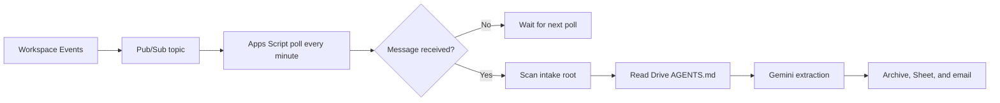
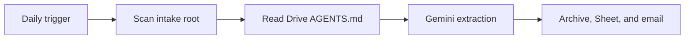

# Operations Runbook

This runbook installs and operates one private instance of the cataloger.
Keep the existing automation enabled until a controlled test proves this one.

## Contents

- [Architecture](#architecture)
- [Prerequisites](#prerequisites)
- [CLI-first installation](#cli-first-installation)
- [Browser-only steps](#browser-only-steps)
- [Configure](#configure)
- [Activate and validate](#activate-and-validate)
- [Cadence and cost](#cadence-and-cost)
- [Use cases](#use-cases)
- [Operations](#operations)
- [Troubleshooting](#troubleshooting)
- [Secrets and cost controls](#secrets-and-cost-controls)

## Architecture

The event path signals a scan; it does not process the event payload directly.



The daily path is the independent safety net.



## Prerequisites

- Google Cloud CLI, Node.js 20 or later, Git, and `jq`.
- A Google account that can create Cloud projects, link billing, and access the
  intake Drive folder and destination spreadsheet.
- A billing account. Workspace Events currently requires billing.
- Access to the [Google Workspace Developer Preview](https://developers.google.com/workspace/preview).

## CLI-first installation

This is the command-line path for a new private installation. It creates a
separate Cloud project and Apps Script project. Do not reuse a Cloud project
that is linked to an unrelated Apps Script project.

```mermaid
flowchart LR
  accTitle: Initial installation path
  accDescr: CLI creates the Cloud and script resources. Browser-only Google controls then link the projects, collect authorization, and store private runtime settings.
  cloud["CLI: Cloud project"] --> apis["CLI: APIs and billing"]
  apis --> key["CLI: Gemini API key"]
  key --> script["CLI: Apps Script and source"]
  script --> link["Browser: Link Cloud project"]
  link --> auth["Browser: OAuth and properties"]
  auth --> activate["Browser: Provision and install triggers"]
```



### Create or select the Cloud project

For a new project, run the following once. Pick a globally unique project ID.
The script selects the first open billing account, so replace that command if
the account should be chosen explicitly.

```bash
set -euo pipefail

PROJECT_ID="my-drive-utilities-cataloger"
PROJECT_NAME="Drive Utilities Cataloger"
BILLING_ACCOUNT_ID="$(gcloud billing accounts list \
  --filter='open=true' \
  --format='value(name)' \
  --limit=1 | sed 's#billingAccounts/##')"

test -n "${BILLING_ACCOUNT_ID}"
gcloud projects create "${PROJECT_ID}" --name="${PROJECT_NAME}"
gcloud billing projects link "${PROJECT_ID}" \
  --billing-account="${BILLING_ACCOUNT_ID}"
```

For an existing project, do not run `gcloud projects create`. Set `PROJECT_ID`
to its ID and verify the prerequisites instead:

```bash
gcloud projects describe "${PROJECT_ID}"
gcloud billing projects describe "${PROJECT_ID}"
```

Enable the complete service set. This command is safe to repeat.

```bash
gcloud services enable --project="${PROJECT_ID}" \
  apikeys.googleapis.com \
  drive.googleapis.com \
  generativelanguage.googleapis.com \
  pubsub.googleapis.com \
  script.googleapis.com \
  sheets.googleapis.com \
  workspaceevents.googleapis.com

PROJECT_NUMBER="$(gcloud projects describe "${PROJECT_ID}" \
  --format='value(projectNumber)')"
printf 'Cloud project number: %s\n' "${PROJECT_NUMBER}"
```

The project number is needed in the browser-only linking step. It is an
identifier, not a secret.

### Create the Gemini key

This creates a key restricted to the Gemini API. It deliberately has no IP or
HTTP-referrer restriction: Apps Script does not provide a fixed caller IP or
browser referrer. Do not create a service-account-bound authorization key.

```bash
gcloud services api-keys create --project="${PROJECT_ID}" \
  --display-name="drive-utilities-cataloger-gemini" \
  --api-target=service=generativelanguage.googleapis.com \
  --format='value(response.keyString)'
```

The command prints the `GEMINI_API_KEY` once. Save it in Bitwarden immediately,
then paste it only into Apps Script Script Properties. Do not place it in a
shell variable, `config.local.json`, source code, or Git.

### Create the Apps Script project and upload source

`clasp create` pulls a default `Code.gs` and manifest. Create the empty script
in a temporary directory so those generated files cannot overwrite this
repository's source or manifest.

Before running this block, complete Browser-only step 2. Complete Browser-only
steps 1 and 3 before activation.

```bash
git clone <repository-url>
cd Google-Drive-Utilities-Cataloger

npx --yes @google/clasp@3.3.0 login --no-localhost

bootstrap_dir="$(mktemp -d)"
(
  cd "${bootstrap_dir}"
  npx --yes @google/clasp@3.3.0 create \
    --type standalone \
    --title "Drive Utilities Cataloger"
)
mv "${bootstrap_dir}/.clasp.json" .clasp.json
rm -rf "${bootstrap_dir}"

# Set the desired IANA time zone in appsscript.json before this upload.
npx --yes @google/clasp@3.3.0 push --force
npx --yes @google/clasp@3.3.0 status
```

The `.clasp.json` file contains the private Script ID and is intentionally
ignored by Git. Do not commit it.

## Browser-only steps

These are Google account controls that do not have a stable, safe CLI path for
this private Apps Script deployment. Complete them once, in the order shown.

| Step | Browser action | Why it remains browser-only |
| --- | --- | --- |
| 1 | Join the Google Workspace Developer Preview. | Drive subscriptions are a Developer Preview feature. |
| 2 | Enable **Google Apps Script API** at <https://script.google.com/home/usersettings>. | This is an account-level clasp prerequisite. |
| 3 | In Google Cloud **Google Auth Platform**, set the audience to **External / Testing** and add the operator as a test user. | Consent audience and test users are managed by Google Auth Platform. |
| 4 | Open the standalone Apps Script project, then **Project Settings > Google Cloud Platform (GCP) Project > Change project**. Enter `PROJECT_NUMBER`. | A `.clasp.json` `projectId` does not link the runtime Apps Script project. |
| 5 | Reauthorize the Apps Script project when prompted. | Linking a standard Cloud project invalidates prior Apps Script grants. |
| 6 | In **Project Settings > Script Properties**, enter the values in [Configure](#configure). | Apps Script has no public Script Properties configuration endpoint. |

Use the same Google account for the Cloud project, Apps Script project, and
Drive resources unless the account has been granted the required permissions.

Do not add an `executionApi` manifest entry or deploy an API executable only to
call setup functions from `clasp run`. That would broaden the script's callable
surface without making the private runtime configuration safer.

Changing the linked Cloud project revokes the existing Apps Script grants.
Reauthorize immediately after the change. It affects only this Apps Script
project, not other Apps Script projects in the same account.

## Configure

Create the private local configuration first:

```sh
cp config.example.json config.local.json
jq empty config.local.json
```

Edit every placeholder in `config.local.json`. It stays in the repository root,
is ignored by Git and clasp, and is never uploaded as a file. Copy its complete
JSON text into the `AUTOMATION_CONFIG_JSON` Script Property.

Set these Script Properties in **Project Settings**:

| Property | Required value |
| --- | --- |
| `GEMINI_API_KEY` | Private Gemini API key. |
| `NOTIFICATION_RECIPIENT` | Report recipient. |
| `ROOT_FOLDER_ID` | Drive intake-root ID. |
| `SPREADSHEET_ID` | Destination spreadsheet ID. |
| `AUTOMATION_CONFIG_JSON` | Complete `config.local.json` text. |
| `GOOGLE_CLOUD_PROJECT_ID` | Linked standard Cloud project ID. |
| `GEMINI_MODEL` | Optional override; defaults to `gemini-2.5-flash`. |

Copy `AGENTS.example.md` to the intake-root folder as `AGENTS.md`, then tailor
only that Drive copy. The script must find exactly one readable, non-empty
policy file before it processes a PDF.

Do not set `PUBSUB_TOPIC`, `PUBSUB_SUBSCRIPTION`,
`WORKSPACE_EVENT_SUBSCRIPTION`, or `WORKSPACE_EVENT_EXPIRES_AT`; the script
maintains them.

## Activate and validate

Run the functions from the Apps Script editor in this exact order.

| Step | Function or check | Expected result |
| --- | --- | --- |
| 1 | `getSetupStatus` | Completes without an authorization or configuration error. |
| 2 | `provisionDriveEventTransport` | Creates the Pub/Sub topic, pull subscription, and Drive event subscription. |
| 3 | `installAutomationTriggers` | Installs the three time-based triggers. |
| 4 | **Triggers** page | Lists daily run, one-minute poll, and six-hour renewal. |
| 5 | Controlled test PDF | Verifies archive, Sheet row, source link, and email report. |

After step 2, verify the provisioned Pub/Sub resources from the CLI. The
automation creates the publisher IAM binding itself; do not add it manually.

```bash
gcloud pubsub topics describe drive-utilities-events \
  --project="${PROJECT_ID}" \
  --format='yaml(name)'
gcloud pubsub subscriptions describe drive-utilities-events-pull \
  --project="${PROJECT_ID}" \
  --format='yaml(name,topic,ackDeadlineSeconds)'
gcloud pubsub topics get-iam-policy drive-utilities-events \
  --project="${PROJECT_ID}" \
  --format=json | jq -e '
    .bindings[] |
    select(.role == "roles/pubsub.publisher") |
    select(.members[] == "serviceAccount:drive-api-event-push@system.gserviceaccount.com")
  ' >/dev/null
```

Expect the topic and pull subscription to exist, an acknowledgement deadline of
`60`, and the Drive event publisher service account to have
`roles/pubsub.publisher` on the topic.

Do not manually run `runDailyUtilitiesCataloging` or
`processDriveEventQueue` as a harmless test: either may process an intake PDF.
Use a controlled test document only after steps 1–4 succeed.

The event subscription has a short lifetime. The six-hour
`renewDriveEventSubscription` trigger renews it before expiry; keep it enabled.

## Cadence and cost

`Config.gs` sets `EVENT_POLL_MINUTES` to `1`. Change it only in source and
redeploy the Apps Script project; then run `installAutomationTriggers` to
replace the existing poll trigger.

| Choice | Effect |
| --- | --- |
| Keep one minute | Lowest event-handling latency; higher Apps Script quota use. |
| Use a longer interval | Lower trigger and URL Fetch quota use; processing may wait up to the interval. |

The interval does not change how many Drive events are published or the
associated Pub/Sub message volume. Apps Script has no per-execution price, and
Pub/Sub bills throughput after its monthly free allowance. For low invoice
volume, extending the interval normally saves no material money. Keep the daily
fallback enabled at every interval.

## Use cases

| Situation | Action | Expected behavior |
| --- | --- | --- |
| First installation | Follow [Activate and validate](#activate-and-validate). | No prior automation is disabled. |
| New PDF added | Wait for event path. | Usually processed after the one-minute poll. |
| Event not received | Wait for daily trigger. | Daily scan catches direct intake PDFs. |
| Change suppliers or folders | Edit `config.local.json`, then replace `AUTOMATION_CONFIG_JSON`. | New rules apply on the next run. |
| Change per-document instructions | Edit Drive `AGENTS.md`. | The next eligible PDF run reads it. |
| Pause safely | Run `removeAutomationTriggers`. | No triggers run; existing files and Sheet rows remain unchanged. |

## Operations

| Function | When to use it | Effect |
| --- | --- | --- |
| `runDailyUtilitiesCataloging` | Scheduled daily fallback only. | Scans and may process PDFs. |
| `processSingleIntakeFile(fileId)` | Controlled single-file test. | May process that intake PDF. |
| `processDriveEventQueue` | One-minute trigger only. | Pulls events and may process PDFs. |
| `renewDriveEventSubscription` | Six-hour trigger only. | Recreates the expiring Drive event subscription when due. |
| `provisionDriveEventTransport` | Initial setup or event repair. | Ensures Pub/Sub and Drive event resources exist. |
| `removeAutomationTriggers` | Pause or retirement. | Deletes only this project's automation triggers. |

After a transport repair, run `installAutomationTriggers` to restore all three
triggers. It removes and recreates only the cataloger's matching triggers.

## Troubleshooting

| Symptom | Likely cause | Recovery |
| --- | --- | --- |
| Pub/Sub says the consumer project is disabled | Apps Script still uses its default Cloud project. | Link the intended standard Cloud project number, then reauthorize. |
| Consent screen blocks execution | OAuth Testing lacks the operator. | Add the account as a test user and rerun `getSetupStatus`. |
| Daily works but event path does not | Event subscription expired or transport is absent. | Run `provisionDriveEventTransport`, then reinstall triggers. |
| Nothing is processed | No direct-root PDF, or `AGENTS.md` is missing, duplicated, invalid, or oversized. | Correct the intake folder; do not move PDFs into subfolders to retry. |
| A document is left untouched | Data, destination, or reconciliation is ambiguous. | Resolve the single reported problem and rerun with a controlled file. |

## Secrets and cost controls

- Save the Gemini API key in a password manager; do not store it in Git,
  `config.local.json`, `AGENTS.md`, documentation, or issue trackers.
- Treat Script Properties as private runtime configuration.
- Set a Cloud billing budget and alerts before enabling events.
- Gemini and Pub/Sub usage is typically small for utility invoices, but quotas,
  tiers, and prices vary by account and model.
